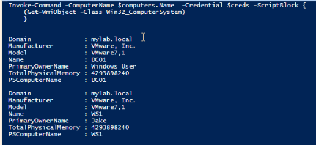
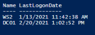

# Enumerating Active Directory Computers

 

###Commands to Enumerate AD Computers

- Get-ADComputer

 

####Examples
    
    # This will give you all the computers within a domain
    Get-ADComputer -filter * 

    # Use the [adsisearcher] type accelerator to retrieve all the computers within the domain
    ([adsisearcher]"(&(objectCategory=computer))").FindAll()

    # Get a specific computer on the domain and return all of its properties
    Get-ADComputer -Identity “DC1" -Properties * 
    
    # Retrieves a count of all the computers on the domain and groups them by the operating system
    Get-ADComputer -Filter "name -like '*'" -Properties operatingSystem | group -Property operatingSystem | 
    Select Name,Count 

    # Get the total number of active computers in Active Directory
    (Get-ADComputer -Filter {enabled -eq "true"}).count
    
    # Returns all the Windows 10 computers on the domain
    Get-ADComputer -Filter "OperatingSystem -like 'Windows 10*'" -Properties * | Select Name, OperatingSystem

    # Listed below is a script to get all computers that have not changed their password in the last 90 days
    $Date = [DateTime]::Today.AddDays(-90) 
    Get-ADComputer -Filter 'PasswordLastSet -lt $Date' -Properties PasswordLastSet | FT Name,PasswordLastSet
    
    
 

####Useful Scripts

Below is a script to first gather all the computers on the domain and then query for some specific computer system info.

    # Change creds as needed
    $Username = 'mylab\administrator'
    $Password = 'password'
    
    # Create Credential Object
    [SecureString]$secureString = $Password | ConvertTo-SecureString -AsPlainText -Force
    [PSCredential]$creds = New-Object System.Management.Automation.PSCredential -ArgumentList $Username, $secureString
    
    # Get all the computers on the domain
    $computers = Get-ADComputer -Filter * | Select Name
    
    # Use the Invoke-Command cmdlet to remotely query for the computer system info for each computer on the domain
    Invoke-Command -ComputerName $computers.Name -Credential $creds -ScriptBlock {
      (Get-WmiObject -Class Win32_ComputerSystem)
      }

Sample Output:

 

It is a good security practice to remove computers from the domain that have not logged in for an extended amount of time.  Listed below is a script to identify computers that have not logged in for the last 120 days.

    # Set the date to 120 days in the past
    $lastLogon = (Get-Date).AddDays(-120)
    
    # Uses the date as a filter and select the name and LastLogonDate properties
    Get-ADComputer -Properties * -Filter {LastLogonDate -lt $lastLogon} | Select Name, LastLogonDate | Sort LastLogonDate

Sample Output:

