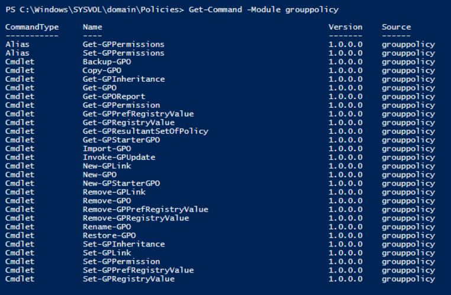

# Active Directory Group Policy

 

#### Group Policy Object Commands
- Get-GPO
- Get-GPOReport
- Get-GPRegistryValue
- Get-GPResultantSetOfPolicy

The list above is not a complete set of GPO commands.  To see all of the GPO Comands use <code>Get-Command -Module grouppolicy</code> .

 

####Examples
    
    # Retrieves all GPOs and displays their name and status
    Get-GPO -all | Select DisplayName, gpostatus

    # Gets the "Default Domain Policy" GPO
    Get-GPO -Name "Default Domain Policy"
    
    # Produces a report in XML that describes the policy settings for a Group Policy Object
    Get-GPOReport -Name “Default Domain Policy” -ReportType XML -Path “C:\Temp\GPOReport.xml”
    
    # Retrieves detailed info about a registry key configured in a GPO
    Get-GPRegistryValue -Name “TestGP” -Key “HKCU\Software\Policies\Microsoft\Windows\Control Panel\Desktop"
    
    # Review which GPOs are applied to a computer and produce a report in XML
    Get-GPResultantSetOfPolicy -Computer dc2 -ReportType XML -Path C:\Temp\GPO.xml
    
 

