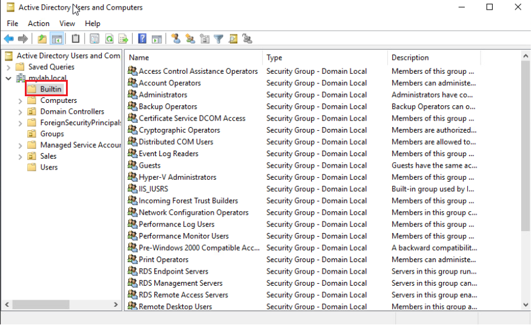
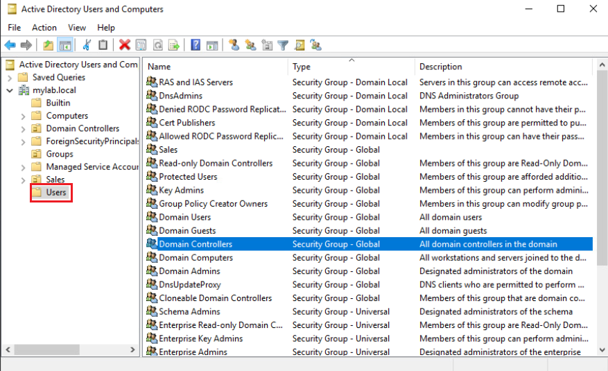

# Enumerating Active Directory Groups

 

###Commands to Enumerate AD Groups

- Get-ADGroup
- Get-ADGroupMember

 

####Examples
    
    # This will give you all of the security groups within a domain
    Get-ADGroup -Filter *

    # Returns a group based of the distinguished name provided with the SearchBase parameter
    Get-ADGroup -Filter * -SearchBase "CN=Sales,OU=Groups,DC=mylab,DC=local"

    # Returns a group based on the SAM name Domain Admins
    Get-ADGroup -Identity "Domain Admins"

    # Returns all of the groups with the SAM name Domain Admins and all of the properties
    Get-ADGroup -Identity "Domain Admins" -Properties *

    # Will provide you with a list of the members in the Domain Admin Group
    Get-ADGroupMember -Identity "Domain Admins"
    
    # Using the Recursive parameter to pull all members of the "Enterprise Admins" group and any subgroups
    Get-ADGroupMember -Identity "Enterprise Admins" -Recursive
    
    # Retrieves all of the members of the Domain Admins that are enabled
    Get-ADGroupMember -Identity "Domain Admins" -Recursive | 
    ForEach-Object {Get-ADUser -Identity $.DistinguishedName} |
    Where {$_.Enabled -eq $true}

 

###AD Group Security

 

####Active Directory Group Types
There are two types of Active Directory Groups, distribution and security. Since we are aiming to evaluate the security of Active Directory, we want to focus on the Security group.

1. **Distribution**: A group that is used for email distribution.
2. **Security**: The group type that governs user and computer access to resources.

 
####Active Directory Security Groups
The members can be users, groups, or computers.  There are two main functions that a security group provides.

1. **Assign user rights**: Used to set what the users in the group can do within a domain or forest.
2. **Assign permissions for resources**: Used to determine what resources can be accessed. 

 

####Active Directory Security Group Scope
There are three levels of scope and each will determine what users can belong to a particular group, along with where in the forest or domain the group's permissions can be applied.

1. **Domain Local**: Can be applied anywhere in the domain and is often used for managing resource permissions.  This group can contain members of any type.
2. **Global**: Define collections of domain objects such as users, computers, or groups.  They are often used as role-based groups for certain business functions like Sales, Accounting, or HR.
3. **Universal**: These groups are used in multi-domain forests.  It provides the ability to set up roles and permissions for resources that are spread across multiple domains.

 

####Default Security Groups

- These are security groups that are created automatically whenever you create an Active Directory domain.
- Primarily used to control access to resources and delegate specific admin roles.
- Some of these groups have extensive permissions, so management of them is paramount.
- The default groups are located in the **Builtin** container and in the **Users** container in Active Directory Users and Computers.

**Builtin container**: contains groups that are defined with Domain Local scope.

 

**Users**: contains groups that are defined with Global scope and Domain Local scope.

 

####Active Directory Group Best Practices

- Create global groups based on roles or departments, such as Sales, Marketing, or Accounting.
  
- Make sure that Active Directory auditing is configured to log all group additions, deletions, and membership modifications.
  
- Be aware of permission inheritance when it comes to group nesting.
    - **Group Nesting** is when you add a group as a member of another group.
      
    - AD will nest groups based on a parent-child hierarchy. For example, if you make *Group A* a member of *Group B*, the users in *Group A* will by default have the same permissions as the users in *Group B*.
    
- Ensure that you provide for a group's end of life.  AD groups should not live beyond their intended purpose.
    - It is not uncommon for organizations to have hundreds of useless groups.
    
    - This could lead to information falling into the wrong hands.
  
    - You can use the code <code>Get-ADGroup LDAPFilter '(!(member=*))'</code> to find groups that do not contain user objects.
    
    - Alternatively, if you do not have the AD PowerShell module, you can use the code <code>(\[adsisearcher]'(&(objectClass=group)(!(member=*)))').FindAll()</code>
     
- Make sure that when new groups are created, they include descriptions of their purpose.

- It is important to regularly review the users that are within groups and evaluating if they still need that level of access.  Users should be given the absolute minimum level of permission necessary to complete their assigned tasks.
    - Users with privileged accounts could very easily spread a virus to the entire domain because that virus would have administrative access.
    
