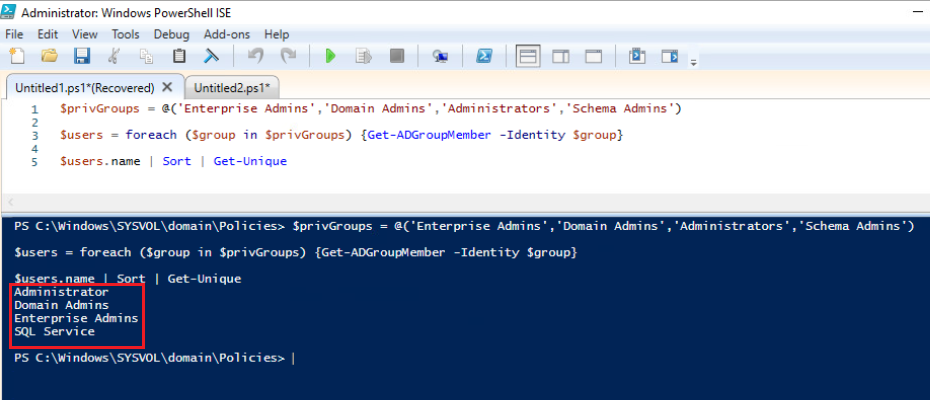
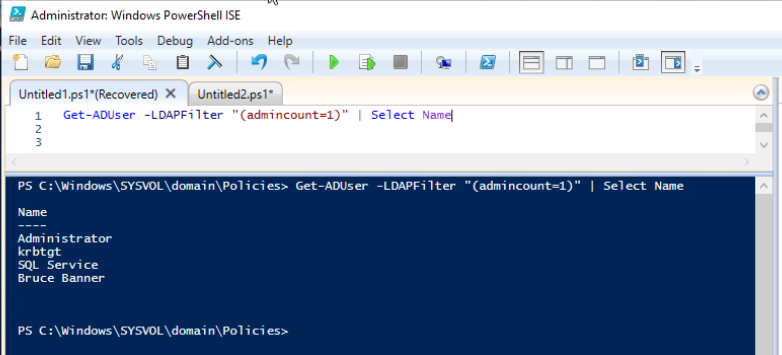
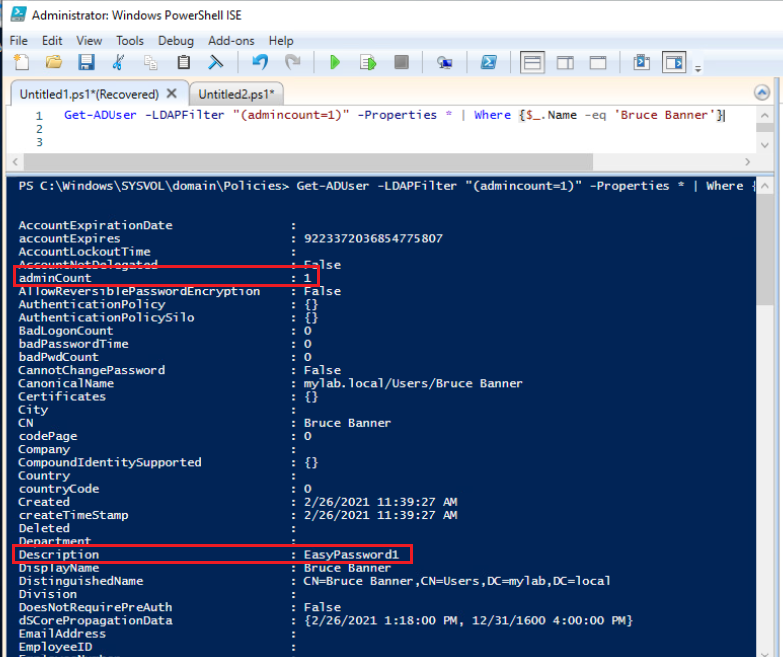
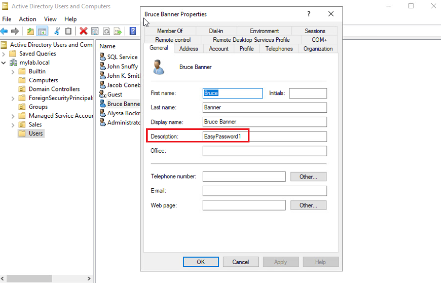
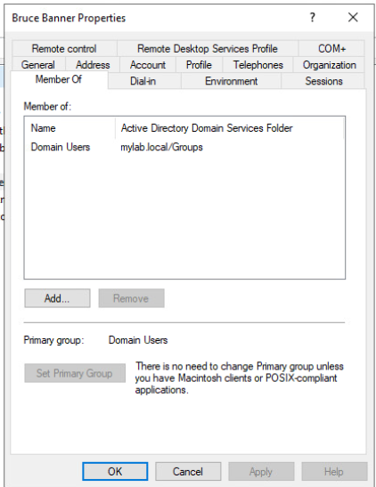

# Enumerating Active Directory Users 

 

####Active Directory for Windows PowerShell Module

- A popular tool used by administrators to manage objects and gather information on computers, users, and groups

- In order to use the Active Directory commands, you need to download the Remote Server Administration Tools (RSAT) for Windows and import the Active Directory module. 
         Import-Module Active-Directory
    
- Use the Get-Command cmdlet to view all the commands available in the Active Directory module 
         Get-Command -Module ActiveDirectory
  
 

####Active Directory Type Accelerators

- The type accelerators **\[adsi]** and **\[adsisearcher]** can both be used to query Active Directory.
  
- These type accelerators allow you to access and manipulate Active Directory objects without having to use additional PowerShell modules.
  - The big takeaway is that you can access Active Directory from any domain connected machine without being Admin, installing RSAT, or importing the AD PowerShell module.

 

####Commands to Enumerate AD Users

- Get-ADUser
- Search-ADAccount

 

####Examples
    
    # This will return all active directory users and their properties from a domain
    Get-ADUser -Filter * -Properties *
    
    # Uses the [adsisearcher] type accelerator to return all users
    $users=[adsisearcher]'(&(objectCategory=person)(objectClass=user))'
    $users.FindAll()
    
    # The command below will look for all users that have "Snuffy" in their name and return the properties specified
    Get-ADUser -Filter {name -like "*snuffy*"} -Properties * | Select Name, LastLogonDate, PrimaryGroup, PasswordLastSet

    # Searches for users in a specific Organizational Unit (OU)
    Get-ADUser -SearchBase "OU=Sales,CN=Users,DC=mylab,DC=local" -Filter *
    
    # Provides a list of users whose passwords never expire
    Search-ADAccount -PasswordNeverExpires | Select Name

    # Search for all users with passwords that never expire without using the AD PowerShell Module
    $ADSearcher = New-Object DirectoryServices.DirectorySearcher -Property @{
    Filter =`
    '(&(samAccountType=805306368)(userAccountControl:1.2.840.113556.1.4.803:=65536))'
    PageSize = 100
    }
    $ADSearcher.FindAll()
    
    # Returns all users who have inactive accounts
    Search-ADAccount -AccountInactive
    
    # Uses Ambiguous Name Resolution (ANR) to query for users in the domain that have "Bruce" in their name
    Get-ADUser -LDAPFilter '(anr=Bruce)'
    
    # Uses ANR with the [adsisearcher] type accelerator to look for all users with "Bruce" in their name
    ([adsisearcher]'(anr=Bruce)').FindAll()

 

####Getting the DistinguishedName for a Domain

- Often you will want to get the *DistinguishedName* of a domain so that it can be used to query some desired information.

  - For example the *DistinguishedName* property can be used with the *-SearchBase* parameter on many of the AD PowerShell cmdlets.

 

Listed below is the code to get the DistinguishedName of the current domain.  This can be used if you are on a computer that is connected to the desired domain.
      
    ([adsi]'').distinguishedName[0]

 

Below is code to be used to query the DistinguishedName for the domain of a remote computer
    
    Invoke-Command -ComputerName <ip address> -Credential (Get-Credential) -ScriptBlock {([adsi]'').distinguishedName[0]}

 

####Password Security

- Weak passwords and password reuse are still commonly used attack vectors used for initial access. Listed below is a script that will find all user accounts that have a password set to never expire.
  
- The code <code>Search-ADAccount -PasswordNeverExpires</code> to show the user accounts that have a password set to never expire.
  
- A poorly implemented Active Directory password policy could be leverage by attackers to eventually obtain privileges that could be used to fully compromise an entire Active Directory forest.  If the forest is fully compromised, attackers can modify or destroy all aspects of the forest.
  
- You can use the cmdlet <code>Get-ADDefaultDomainPasswordPolicy</code> to view the Active Directory password policy on the domain and determine if it is using a proper complexity requirement.

 

###Reviewing Active Directory Users for Security Issues

 

####Ensure that users do not have rights to add computers to the domain
    
  - In a default installation of Active Directory, any domain user can add workstations to the domain. This is defined by the **ms-DS-Machine-Quota** attribute which is by default set to 10.

  - This allows any user to join their own computer to access the domain with the following capabilities
    - No Antivirus or EDR solution will be pushed to the system
    - No GPO settings or policies will be applied to the system
    - Allows them to have Admin rights on the system

 

You can check the ms-DS-MachineAccount Quota attribute by using the code below

    # Get the Distinguished Name for the Domain
    $distName = (Get-ADDomain).distinguishedname

    # Pull the ms-DS-MachineAccount property
    Get-ADObject -Identity $distName -Properties ms-DS-MachineAccountQuota

 

Listed below is the code that you can use to list all computers that were added by non-admins.

    Get-ADComputer -LDAPFilter "(ms-DS-CreatorSID=*)" -Properties ms-DS-CreatorSID

 

####Make sure that the **AdminCount** attribute is not be set on common users

- The AdminCount attribute is used to protect administrative users and members of privileged groups.
  
- This attribute should never be set on common users since it will give them higher than necessary privileges.
  
- Represents a huge risk in that it could create a situation where there are "backdoor" users in the organization.
  
- It is very easy for this vulnerability to be created as the AdminCount attribute is set to 1 automatically whenever a user is assigned to a privileged group.  However, it is not automatically unset when the user is removed.

 

Use the command <code> Get-ADUser -LDAPFilter "(admincount=1)"</code> to get a list of users with the AdminCount attribute set to 1.

 

####Check if there are users with excessive privileges making them shadow Domain Admins

- It is very common for low privileged users to be mistakenly given extended rights, essentially making them a domain admin.  Users with these types of rights are called **Hidden Admins**.

- Some extended rights are listed below:
  - **ForcedChangePassword**: Gives the ability to reset the password of another user
  - **GenericAll**: Gives one full control over an object (read/write)
  - **GenericWrite**: Allows you to update any attributes of an object
  - **WriteOwner**: Allows one to assume ownership of an object
  - **WriteDacl**: Gives the ability to modify the DACL of an object
  - **Self**: Allows one to arbitrarily modify self  

 

###Active Directory Users Exercise

For this exercise, I do not expect you to type any of these commands and instead would just like you to follow along with the narrative.
 

In this scenario, you are performing a review of a client's Active Directory users.

 

To start, you use the code below to look for all the users contained in privileged groups.

    $privGroups = @('Enterprise Admins','Domain Admins','Administrators','Schema Admins')
    $users = foreach ($group in $privGroups) {Get-ADGroupMember -Identity $group}
    $users.name | Sort | Get-Unique

 

So far so good, you do not see any users that should not be in these groups.  However, to double check, you decide to use the code below to retrieve a list of users with the **AdminCount** attribute set.  As a reminder, this will give a user advanced privileges.

    Get-ADUser -LDAPFilter "(admincount=1)" | Select Name

Notice, how there is a low level user named "Bruce Banner" with this attribute set.  This is a huge issue and warrants additional investigation.

 

You decide to use the code below to look at the properties of the user named "Bruce Banner".

    Get-ADUser -LDAPFilter "(admincount=1)" -Properties * | Where {$_.Name -eq 'Bruce Banner'}

Immediately, you can see that the *adminCount* property is set to 1.  However, it gets even worse, it appears that the Active Directory Admin decided to save the password in the *Description* field.  Occasionally, new Active Directory Admins will do this for convenience and not understanding how easily this property can be accessed.

 

Given the gravity of the security risk, you go to talk to the Active Directory Admin immediately.  He pulls up Active Directory Users and Computers and gasps at the password being in the Description.  Apparently, they have an intern helping them that must have made the error. He also clicks on the *Member Of* tab showing that this user is only a member of the Domain Users group.

 

After speaking with the intern, it was determined that "Bruce Banner" is a valid employee at the company that wanted to download and test some software for the Sales department.  He put him in the domain admins group temporarily to accomplish the task but removed him later that week.  Not knowing about the *adminCount* property, he incorrectly thought it was fixed.

The SDPROP task is run is automatically run hourly in Active Directory.  When an account is added to a protected group, this task will identify the member as being part of a protected object set by setting the *adminCount* property to 1.

