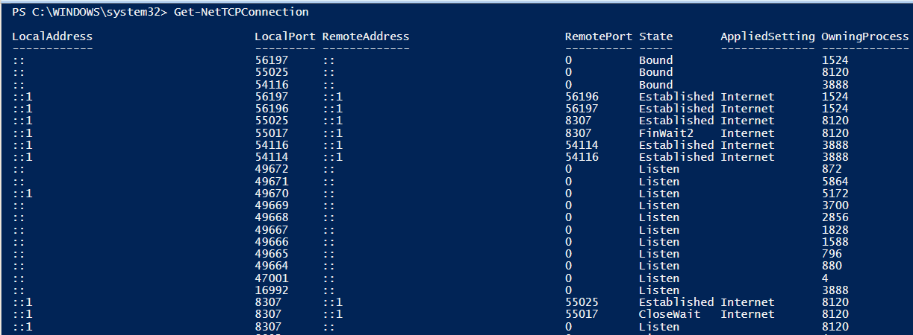
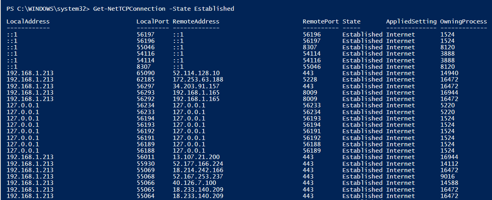
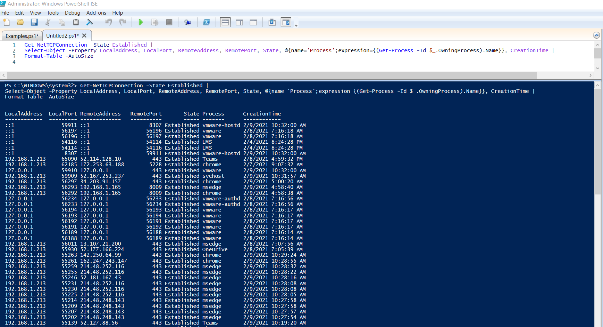
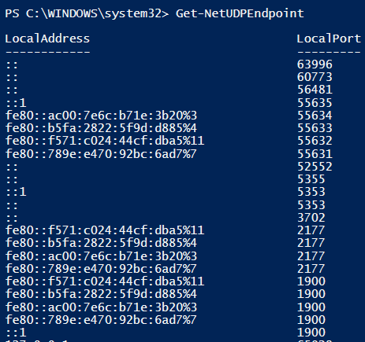
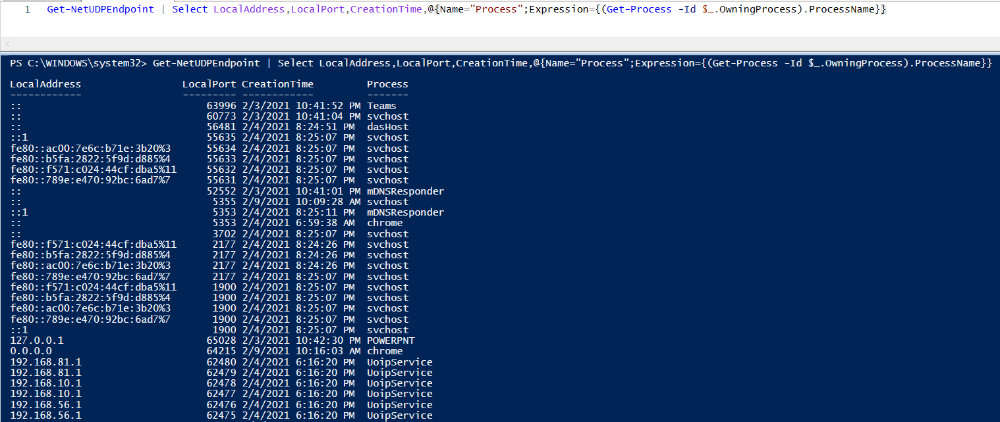
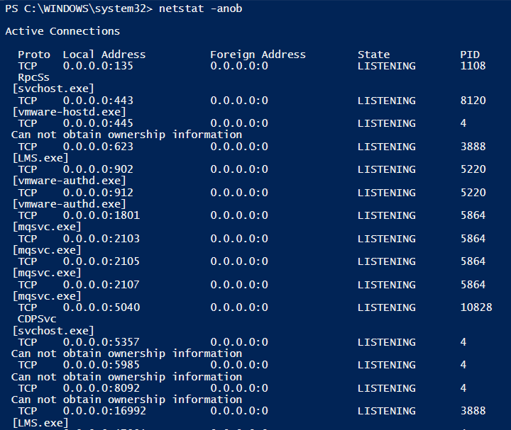

# Connections

####PowerShell commands to gather connections

- Get-NetTCPConnection
- Get-NetUDPEndpoint

 

####Examples
      # Example 1 - Uses the Get-NetTCPConnection cmdlet to pull established TCP connections
      Get-NetTCPConnection | Where-Object State -eq Established | Select LocalAddress, LocalPort, OwningProcess, RemoteAddress, RemotePort
      
      # Example 2 - Uses the Get-NetTCPConnection cmdlet to pull established TCP Connections and gets the process name that started the connection
      Get-NetTCPConnection -State Established | Select-Object -Property LocalAddress, LocalPort, RemoteAddress, RemotePort, State,
         @{name='Process';expression={(Get-Process -Id $_.OwningProcess).Name}}, CreationTime | Format-Table -AutoSize
      
      # Example 3 - Uses the Get-NetUDPEndpoint to find open UDP ports on the machine
      Get-NetUDPEndpoint | Select LocalAddress,LocalPort,CreationTime,@{Name="Process";Expression={(Get-Process -Id $_.OwningProcess).ProcessName}}
   
 

It is important to note that unlike the netstat command in DOS, PowerShell splits TCP and UDP into two different commands, Get-TCPConnection and Get-NetUDPEndpoint.
Keep in mind that DOS commands work in PowerShell as well and there is nothing wrong with adding <code>netstat -anob</code> to your script to make sure that you capture everything.

 

####PowerShell Connections Exercise

 

Type <code>Get-NetTCPConnection</code> into the PowerShell terminal and examine the output.  Notice how it lists the process ID that started the connection.  This is incredibly important for analysis and could help detect if malware opened a connection.

 

It would be nice if we could just see the established connections.  Type <code>Get-NetTCPConnection -State Established</code> into the terminal and examine the output.

 

Now, lets grab the process name as well. Copy the code below and paste it into the PowerShell ISE script pane and hit the *f5* key to execute the script.

      Get-NetTCPConnection -State Established | 
      Select-Object -Property LocalAddress, LocalPort, RemoteAddress, RemotePort, State, @{name='Process';expression={(Get-Process -Id $_.OwningProcess).Name}}, CreationTime | 
      Format-Table -AutoSize

 

Type <code>Get-NetUDPEndpoint</code> into the terminal and examine the output.  This is how you determine what UDP ports are open on the endpoint.

 

Now, lets select some additional fields to make this output more useful. Copy the code below and paste it into the PowerShell ISE script pane and hit the *f5* key to execute the script.

      Get-NetUDPEndpoint | Select LocalAddress,LocalPort,CreationTime,@{Name="Process";Expression={(Get-Process -Id $_.OwningProcess).ProcessName}}

 

Finally, lets type the old reliable DOS command <code>netstat -anob</code> into the terminal and examine the output.  Notice how this command's output displays just about everything that was useful from the PowerShell commands and is a much shorter command to type.

 

There are a couple lessons learned from this, one being that PowerShell cmdlets are not always better than the old DOS commands.  The big takeaway though is that there are always many ways to accomplish something when it comes to scripting and having the knowledge to do something multiple ways is always useful.  The PowerShell cmdlets produce a fully functional object whereas the DOS commands will produce a string object, meaning that the PowerShell objects are generally easier to manipulate.

