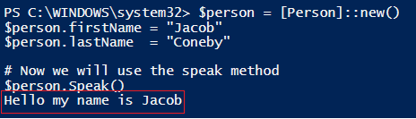

# PowerShell Data Structures

 

####Purpose of Data Structures

- They are used for organizing, processing, retrieving, and storing data.  They are used to arrange data in a way that can makes it easier to work with and accomplish programming objectives.

 

####Data Structure Types

1. Array

2. ArrayList

3. Tuple

4. Hash Table

5. Classes

 

###Arrays

 

####Description

- An immutable data structure that can hold heterogeneous elements.  It is designed to store a collection of items.

- Although technically immutable, you can change the elements in an array. PowerShell does this by creating a new array with the values of the original array and the added value.

 

####Examples of Array Creation

- <code>$myArray = 1,2,3,4,”five”</code>

- <code>$myArray = @(1,2,3,4,”five”)</code>

 

####Adding an item to an Array

- You can easily add an item to an array by using the "+=" operator
    - <code>$myArray += 6</code>
    
 

####Removing an item from an Array

Removing an item from an array is a bit tricky.  Since Arrays are immutable, you really cannot remove items, but instead create a new array with only a certain desired range value from the old array.

Listed below is an example of removing the last item from an Array.  This code can be changed to include whatever range desired.

    $myArray = $myArray[1..($myArray.Length -1)]

 

####Referencing an item in an Array

- To reference an item in an array, use the variable name followed by its position.
    - <code>$myArray\[0]</code> would return the first item in the array
      
    - <code>$myArray\[-1]</code> would return the last item in the array
    
 

####Array Exercise
1. Create an array containing the names of three operating systems
2. Return just the first item in the array
3. Change the last item in the array to be a different OS
4. Add an OS to the array
5. View the methods on the array object you created. Do you see any methods that allow removal of objects?
6. Attempt to remove an item from the array

 

###ArrayList

 

####Description

- Very similar to an array and is another way that you can store a list of items in PowerShell

- The ArrayList class is part of the System.Collections namespace within .NET

- Syntax is more complicated than a regular array, however, you get more flexibility

- Reference the values the same way as with Arrays by using the variable name and its position in the list

 

####Creating an ArrayList

- The process is very similar to creating a normal array, except you typecast it with the \[Systems.Collections.ArrayList] class.
    - <code>$myArrayList = \[System.Collections.ArrayList]@(1,2,3,4,5,”six”)</code>
    
 

####Adding an item in an ArrayList

- You can use the **Add** method to add an item to the array
    - <code>$myArrayList.Add(“six”)</code>
    
- You can also use the "+=" operator to add an item to the array
    - <code>$myArrayList += "six"</code>

 

####Removing an item from an ArrayList

- You can use the **RemoveAt** method to delete an item using an index number.
  - <code>$myArrayList.RemoveAt(3)</code> will delete the fourth item in the array.
    
  - <code>$myArrayList.RemoveAt($myArrayList.Count - 1)</code> will delete the last item in the array.
    
- You can sue the **Remove** method to delete a specific item by name in an array
  - <code>$myArrayList.Remove(“six”)</code>
    
 

####ArrayList Exercise
1. Create an ArrayList that contains the names of some animals
2. Add an animal to your ArrayList
3. Remove a specific animal from your ArrayList  

 

###Tuples

 

####Description

- An immutable data structure

- After a tuple is defined, you can no longer add, delete, or edit any of its values.

- Very useful in situations in which you do not want someone else to edit or manipulate your data structure.

 

####Creating a Tuple

- Create a tuple by using \[System.Tuple]::Create()
  - <code>$tuple = \[System.Tuple]::Create(1,2,3,4)</code>
    
 

####Referencing an item in a Tuple

- It can be referenced the same way was an array by using an index reference.
  - <code>$tuple\[0]</code>
    
- You can reference an item by referencing the tuple object's property
  - <code>$tuple.Item1</code>
    
 

####Tuple Exercise
1. Create a tuple of various numbers
2. Ask the user to guess the number of Item 1 in the tuple and save it to a variable
3. Produce True or False output depending on if the user guessed correctly

 

###Hash Tables

 

####Description

- Key-value pairs

- Very similar to a dictionary in Python

- A collection of values that can be indexed by a key name

 

####Creating a Hash Table

- Use the syntax @{*key* = *value*}
  - <code>$hash = @{rank = “SrA”; lastname = “Snuffy”}</code>
   
 

####Referencing a property in a Hash Table

- You can reference a property by using the variable and the property name
    - <code>$hash.rank</code> will reference the rank property
    - <code>$hash.lastname</code> will reference the lastname property
    
 

####Examples

    # Get the file size in MB of all the files in the current directory
    Get-ChildItem | Select Name,@{n="File Size";e={[math]::Round(($_.Length/1MB),4)}}
    
    # Get the established connections on the computer and use a hash table to resolve the ip address
    Get-NetTCPConnection -State Established | 
    Select LocalAddress,LocalPort,RemoteAddress,RemotePort,@{n="NameHost";e={(Resolve-DnsName $_.RemoteAddress).NameHost}} | FT 

 

####Hash Table Exercise
1. Look at the properties available in the Get-CimInstance Win32_Process.  Notice that there is a ParentProcessID property, however, there is no ParentProcess name.
2. Utilizing the Get-CimInstance Win32_Process cmdlet select the Name, ProcessID, and ParentProcessID 
3. Now using a hash table, select an additional field which will display the ParentProcessName of each process
4. Sort the object by ProcessID		

 

###Classes

 

####Description

- They are the templates that are used to create objects
  - Objects are a way of encapsulating data and functionality that simulates the real world
    
- You can make PowerShell classes that are very simple or they can be quite complex.
 

####Defining a Class

- You define a class by using the *class* keyword.
  - The syntax is <code> class ClassName { }</code>
    
In the example below, a simple class called "Person" is created.  This class has a couple properties, however, we did not have any methods.  Unlike many programming languages, after we create the class it will automatically be given a default constructor.  However, you can also explicitly define a constructor.

    class Person {
        [string]$firstName
        [string]$lastName
        [string]$gender
        [string]$eyeColor
        [int]$age
    }

You can instantiate the new person object by using the **new()** method.  In the script below a new Person object is created and saved to the $person variable. The object is then piped to the Get-Member variable.

    $person = [Person]::new()
    $person | GM

Output:

 

####Methods

- A set of instructions that specify an action that can be performed on the object.
- They allow you to add program code to your objects

In the example below a method called "Speak" was added to our Person class.

    class Person {
      [string]$firstName
      [string]$lastName
      [string]$gender
      [string]$eyeColor
      [int]$age
      Speak() {
          Write-Host ('Hello my name is ' + $this.firstName)
      }
    }

Now, we can create an object and test out the method.

    $person = [Person]::new()
    $person.firstName = "Jacob"
    $person.lastName  = "Coneby"
  
    # Now we will use the speak method
    $person.Speak()
    
Output:

You can see that the speak method produced the desired result

 

####Constructors

- A special method which is invoked automatically at the time of object creation.  Generally, it is used to initialize the data members of the new object.  The constructor is easy to identify because it has the same name as the class.

The syntax for creating a constructor is the same as any other method, however, it must be the same name as the class.  Listed below is the "Person" class which now contains a constructor.

    class Person {
      [string]$firstName
      [string]$lastName
      [string]$gender
      [string]$eyeColor
      [int]$age
  
      # Constructor
      Person(
          [string]$firstName,
          [string]$lastName,
          [int]$age
       ){
          $this.firstName = $firstName
          $this.lastName = $lastName
          $this.age = $age
        }
  
      # Speak method
       Speak() 
       {
         Write-Host ('Hello my name is ' + $this.firstName)
       } 
    }

When creating the object, it is very similar as before, except this time you need to include the parameters that you set in your constructor.

    # Create a new person object
    $person = [Person]::new("Jacob","Coneby",30)
    
    # Select all of the object's properties
    $person | Select *

 

####Classes Exercise
1. Create a “Machine” class with the following properties listed below
  - ComputerName = $env:COMPUTERNAME
  - IP = (Get-NetIPAddress -AddressFamily IPv4).IPAddress
  - SystemInfo = (Get-ComputerInfo)
  - ProcessorArchitecture = $env:PROCESSOR_ARCHITECTURE 
  - Processes = (Get-CimInstance Win32_Process)
  - Services = (Get-CimInstance Win32_Service)
  - CaptureTime = (Get-Date)

2. Next, give the Machine class a method called “Restart” that will Restart the computer when used.  You can use the <code>Restart-Computer</code> cmdlet to accomplish this.  Also, you probably want to use the <code>-confirm</code> parameter if you want to test out the class.
   
3. Give the Machine class a method called “UpdateCaptureTime” that will update the capture time property to be the current date/time.
   
4. Create a new object using the “Machine” class and review its properties and methods
   
5. Use the “UpdateCaptureTime” method on the object and then review the CaptureTime property

 

###PS Custom Object

 

####Description

- Provides a very simple way to create structured data.
- It is very similar to a hashtable where data is stored in key-value pairs.

 

####Creating a PS Custom Object

- In order to create the object, you must use the type accelerator **\[PSCustomObject]** in front of a hash table.

In the example below, a PSCustomObject was created and saved to the variable $sr71.  It contains some properties of an SR-71 "Blackbird".

    $sr71 = [PSCustomObject] @{
          Creator     = 'Lockheed'
          Airframe    = 'Titanium'
          firstFlight = [DateTime]'12/22/1964'
          mph         = [int]2193
    }

To see the object's properties you can pipe the variable to a Format-List cmdlet or just type the variable name

    $sr71 | FL

Output:

 

####Referencing a property in a PSCustomObject

- This is done the same was as in a hashtable
  - code>$sr71.Airframe</code> will reference the Airframe property
  
 

####Example

Often there are Windows commands that work well, however, it would be nice if we could get an object containing structured data instead of a string. You can see that <code>arp -a</code> produces good output, but the data is not structured.  This severely limits the flexibility of what we can do with this object. 

If you look at the properties of the output of the <code>arp -a</code> command, you can see that it only contains the *Length* property.  Also, the object type is *System.String*.

In the example below, we are going to iterate through all the lines produced in ARP and create a PSCustomObject for each entry. As a result, we will have an array of PSCustomObjects saved in the $arp variable.
            
            # Save the results from ARP into a variable
            $arp = arp -a
            
            $arp = arp -a

            $arp = foreach ($line in $arp)
            { 
            $line = $line -replace '^\s+',''
            $line = $line -split '\s+'
            if($line[0] -ne $null -and $line[1] -ne $null -and $line[2] -ne $null -and $line[0] -ne "Interface:" `
                -and $line[0] -ne "Internet" ){
                [PSCustomObject]@{
                    ComputerName = $env:COMPUTERNAME
                    Address      = $line[0]
                    MAC          = $line[1]
                    Type         = $line[2] }
                }
            }

Now if we look at the object's members, you can see it has properties which can be referenced.  We now have a nice array of objects containing structured data which can be easily referenced and manipulated.

 

####PSCustomObject Exercise

1. Run the Get-NetTCPConnection cmdlet 
   - Notice that it provides the Owning Process ID, however, it does not show the process name
2. Save the established connections to a variable
3. Using a foreach loop, create a PSCustomObject for each connection that will include the properties below.
  - LocalAddress
  - LocalPort
  - RemoteAddress
  - RemotePort
  - OwningProcessID
  - OwningProcessName
4. Output the object as a Table

Since we have not reviewed loops yet, I provided the code below. Be sure to place your PSCustomObject within the brackets of the foreach loop.
      

      $connections = Get-NetTCPConnection -State Established
      
      $connectionList = foreach ($connect in $connections)
      {
          [PS Custom Object Code Placed Here]
      
      }

