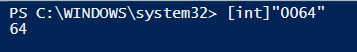
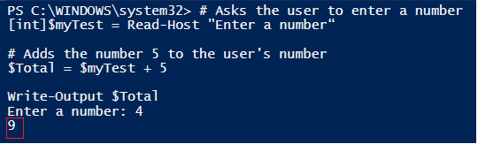
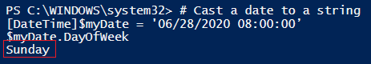

# Data Type Conversion

 

####Purpose

- In PowerShell, all objects have a specific data type which is assigned to them.  There will be times when you will need to convert these data types in order to accomplish your objective.

 

####Data Types (Type Accelerators)

- To see an object’s current data type, you can pipe it to the <code>Get-Member</code> cmdlet

 

Below is a table of some of the most common data types (type accelerators) that you will see in PowerShell.

|*Data Type*       | *Description*                                                        |
|------------------|----------------------------------------------------------------------|
| \[int]           | Any numeric value                                                    |
| \[long]          | 64-bit signed integer                                                |
| \[float]         | A decimal separated numeric value                                    |
| \[string]        | Any alphabetical and numeric text                                    |
| \[char]          | A Unicode 16-bit character                                           |
| \[array]         | A collection of index values                                         |
| \[bool]          | Only matches two conditions, True or False                           |
| \[datetime]      | Object in the common date and time format readable by PowerShell     |
| \[hashtable]     | A collection of key value pairs                                      |
| \[pscustomobject]| The data type of a PowerShell object                                 |
| \[xml]           | XML object                                                           |

 

To see a list of all the type accelerators available, you can use the code below.

    [psobject].Assembly.GetType("System.Management.Automation.TypeAccelerators")::Get

 

####Casting

- To convert a value or variable to a specific datatype, you have to prefix it with the data type in square brackets.  When the cast operator is in front of the variable or value, it forces the desired datatype.
  - The syntax is \[datatype]$var
    
 

####Examples

 

Casting a string as an integer

    # Convert string to an integer
    [int]"0064"

Output:

 

The script below asks a user to enter a number. Notice that the variable containing the user's input is casted as an integer.  It then takes the user's input and adds 5 to the value.  If it was not casted as an integer, it would result in string concatenation.

    # Asks the user to enter a number
    [int]$myTest = Read-Host "Enter a number“

    # Adds the number 5 to the user's number
    $Total = $myTest + 5
    Write-Output $Total

Output:

 

In the example below, a string is casted with \[datetime] resulting in a date object. The *DayOfWeek* property is then selected from this object.

    # Cast a date to a string
    [DateTime]$myDate = '06/28/2020 08:00:00’
    $myDate.DayOfWeek

Output:

You can see that it returns the day correctly as "Sunday".

