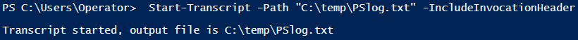

# Documenting Your Commands

During an engagement, one can easily forget to document the commands that were executed.  
Luckily, PowerShell has a cmdlet that will document which commands are used and include the time they were executed.

 

####PowerShell cmdlet to start logging commands
- Start-Transcript

 

####PowerShell cmdlet to stop logging commands
- Stop-Transcript

 

####Example
- <code>Start-Transcript -Path "C:\temp\PSlog.txt" -IncludeInvocationHeader</code>
- The -Path parameter is where you want to save the log
- The -IncludeInvocationHeader is an important parameter to include because this will document the time each command is executed 

 

###PowerShell Transcript Exercise

 

Enter <code>Start-Transcript -Path "C:\temp\PSlog.txt" -IncludeInvocationHeader</code> into the PowerShell terminal

Type a few random commands into the terminal

Enter the <code>Stop-Transcript</code> cmdlet to stop transcribing

Type <code>Get-Content -Path "C:\temp\PSlog.txt"</code> to view the command log that you created

 

