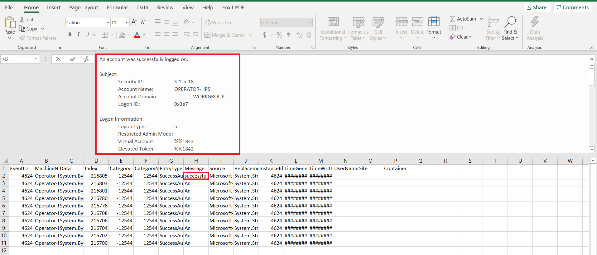

# Event Logs 

 

It is critical that you know how to pull event logs from systems.  Often during an engagement the client will not have software on their endpoints that push logs.  In addition, they may be leery on allowing this type of software on their machines.  If this is the case, you can still leverage PowerShell to pull event logs.
 
Indicators of compromise may be found in the event logs which was missed during network security monitoring.  There may be blind spots or missing network data for which analyzing event logs may assist in filling the gaps.  In addition, event logs can be a great way to detect if malicious tools were utilized on the network.

 

####Important Event IDs
|*Event ID*  | *Description*                            |
|------------|------------------------------------------|
| 4624       | User Logon                               |
| 4634       | User Logoff                              |
| 4688       | Process Launch                           |
| 4698       | Scheduled Task Creation                  |
| 4702       | Scheduled Task Updated                   |
| 4740       | User Account Lockout                     |
| 4625       | Failed Logon                             |
| 5152       | Windows Filtering Blocked a Packet       |
| 5154       | Listening Port Opened                    |
| 5156       | Connection Allowed                       |
| 5157       | Connection Blocked                       |
| 4648       | Logon Attempt Using Explicit Creds       |
| 4672       | Special Privileges Assigned to New Logon |
| 4673       | Privileged Service Called                |
| 4769       | Kerberos Service Ticket Requested        |
| 4771       | Kerberos Pre-Authentication Failed       |
| 5140       | Network Share Object Accessed            |

 

####Event Log Resources 

- *[Event Log Encyclopedia](https://www.ultimatewindowssecurity.com/securitylog/encyclopedia/default.aspx?i=j)*
  - An encyclopedia of windows event logs

 

- *[Tool Analysis Result Sheet](https://jpcertcc.github.io/ToolAnalysisResultSheet/)*
 - JPCert's summarized list of logs produced by the 49 tools most likely to be used by an attacker.

 

- *[Spotting the Adversary](https://apps.nsa.gov/iad/library/reports/spotting-the-adversary-with-windows-event-log-monitoring.cfm)*
 - NSA paper explaining methods to detect adversaries using Windows Event Log monitoring.

 
   
###Gathering Event Logs

 

####Event Log Commands

- Get-EventLog
  - The <code>Get-EventLog</code> cmdlet will query events and event logs from local or remote computers
  - Details are often in the “message” and “ReplacementStrings” properties

 

- Get-WinEvent
 - Will query events from event logs and event tracing log files on local and remote computers
 - It has hundreds more logs available to query from than Get-EventLog
 - Powerful, but the syntax can be difficult

 

####Examples
    # Uses the Get-EventLog cmdlet with the LogName parameter to pull the Security log
    Get-EventLog -LogName Security
  
    # Uses the LogName, InstanceID, and Newest parameters to pull the newest 10 entries of successful logins
    Get-EventLog -LogName Security -InstanceID 4624 -Newest 10
    
    # Utilizes a date range when pulling the Security log
    Get-EventLog -LogName Security -After (Get-Date -Date '06/16/2020 08:00:00’) -Before (Get-Date -Date '06/16/2020 17:00:00’)
    
    # Pull the System event log from a remote computer
    Get-EventLog -LogName System -ComputerName DC1 
    
    # This will show you the logs available to query using the Get-WinEvent cmdlet
    Get-WinEvent -ListLog * 
    
    # Utilizes a hash table to pull successful logins from the Security Log in the defined date range
    Get-WinEvent -FilterHashtable @{ LogName = ‘Security’; StartTime = (Get-Date -Date '07/05/2020 08:00:00’); Id=4624}

 

###Exporting Event Logs

 

You will most likely want to export your event logs to a file so that you can access them later.  The two file types most often used to accomplish this are CSV and XML.  After they have been exported to a file, you can then import those files into PowerShell as an object.

 

####Export Commands

- Export-Csv
- Export-Clixml

 

####Import Commands

- Import-Csv
- Import-Clixml

 

####Examples
    
    # Exports the newest 10 security events to a CSV file
    Get-EventLog -LogName Security -Newest 10 | Export-Csv -Path 'C:\Temp\security.csv' -NoTypeInformation
    
    # Exports the newest 10 security events to a XML file
    Get-EventLog -LogName Security -Newest 10 | Export-Clixml -Path 'C:\Temp\security.xml'
    
    # Imports the CSV file into an object stored in the $securityLog variable
    $securityLog = Import-Csv -Path 'C:\Temp\security.csv'
    
    # Imports the XML file into an object stored in the $securityLog variable
    $securityLog = Import-Clixml -Path 'C:\Temp\security.xml'

 

###Exporting Event Logs to .evtx format

- When you export the event logs to .evtx format, you are able to analyze through the Windows Event Viewer App
- The two methods for doing this are using the wevutil command or the .NET [System.Diagnostics.Eventing.Reader.EventLogSession] class.

####WevUtil Script Example
    
    <# This script will create a copy of the Security Log on the remote machine in .evtx         format #>
    
    Invoke-Command -ComputerName "192.168.1.197" -Credential $creds -ScriptBlock {

    $start = '05/30/2021'
    $end = '06/01/2021'

    function GetMilliseconds ($date) {
        $ts = New-TimeSpan -Start $date -End (Get-Date)
        [math]::Round($ts.TotalMilliseconds)
        } # end function

    $startDate = GetMilliseconds(Get-Date $start)
    $endDate = GetMilliseconds(Get-Date $end)
    wevtutil epl Security C:\Temp\security.evtx /q:"*[System[TimeCreated[timediff(@SystemTime) >= $endDate] and TimeCreated[timediff(@SystemTime) <= $startDate]]]"

    }

 

###Event Log Exercise

 

Paste the code below into the PowerShell ISE script pane and hit the *f5* key to execute.

    Get-EventLog -LogName Security -InstanceID 4624 -Newest 10 | Export-Csv -Path 'C:\Temp\security.csv' -NoTypeInformation

 

Open the CSV file and examine the output. Notice how we can tell by the message field that this event log entry shows the successful account logons to the system.  Keep in mind that this entry will be generated if it is a friendly or an adversary.

 

Expand the content of the cell in the *Message* column and notice all the additional information that it contains.  Some key info includes: Logon Type, Process Info, and Workstation Name.  Sometimes you can detect a rogue actor on your network by examining the workstation name and noticing it doesn't follow the typical naming convention in your organization.

 

Often you will want to import a previously saved CSV file to be analyzed in PowerShell.  Type <code>$securityLog = Import-Csv -Path 'C:\Temp\security.csv'</code> into the terminal.  This will import the CSV file as an object and save it to a variable in PowerShell.

 

Pipe the *securityLog* variable to the Get-Member cmdlet using the code <code>$securityLog | GM</code> and examine the various properties and methods available to this object.

 

You can access a single property by type the variable followed by a dot and then the property name.  For example, <code>$securityLog.Index</code> will return just the index numbers of all the events stored in the object.

 

Next, we will demonstrate the power of the **FilterHashtable** parameter available with the Get-WinEvent cmdlet.

 

Start by creating a CSV file similar to the one below containing some critical Event IDs.  Save the file as *CriticalEvents.csv*.

 

Copy and paste the code below into the PowerShell ISE script pane.  Before hitting the *f5* key to execute, make sure that the path to your CriticalEvents.csv file is correct.  Also, adjust the date to be in the recent past as it will take a long time to execute otherwise.  Keep in mind, that it is normal to receive similar errors as in the screenshot below if there are no event logs that meet the criteria.

    $events = Import-Csv -Path 'C:\Temp\CriticalEvents.csv'
    $startTime = Get-Date -Date '02/20/2021 08:00:00’
    $critical = foreach ($event in $events)
                {
                   Get-WinEvent -FilterHashtable @{ LogName = $event.LogName; StartTime=$startTime; Id=$event.EventID} 
                }

 

Type <code>$critical | Group-Object -Property Id</code> into the terminal in order to Group all the event logs by Event ID.  Using the Group-Object cmdlet can be a great way to perform least frequency analysis and find anomalies.

 

