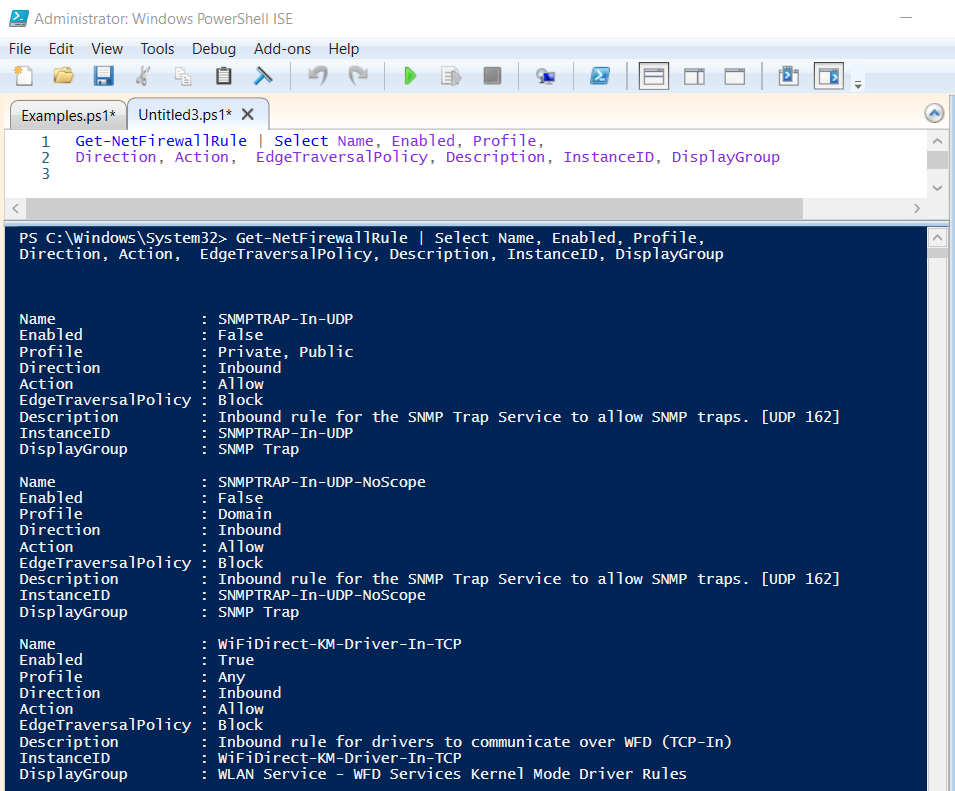
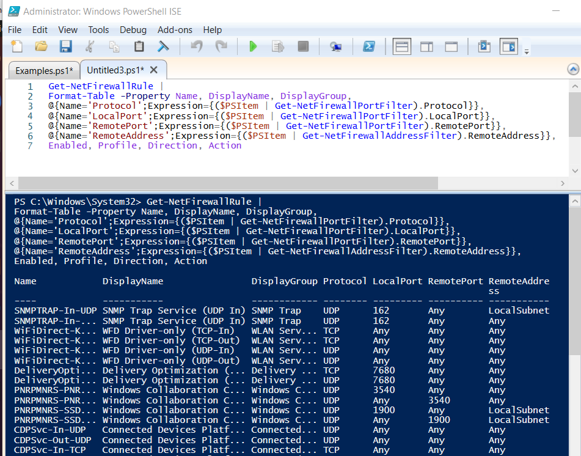

# Firewall Information

####Firewall Profile Info

- Get-NetFirewallProfile

 

####Firewall Profile Example

    Get-NetFirewallProfile | Select Profile, Enabled, DefaultInboundAction, DefaultOutboundAction, AllowInboundRules, AllowLocalIPsecRules, AllowUserApps, AllowUserPorts

 

####Firewall Rules Info

- Get-NetFirewallRule

 

####Firewall Rules Example

    Get-NetFirewallRule  | Select Name, Enabled, Profile, Direction, Action, EdgeTraversalPolicy, Description, InstanceID, DisplayGroup

 

 

Although <code>Get-NetFirewallRule</code> does a good job of showing the rules, it does not show ports. To solve this, you can create calculated properties and utilize other cmdlets called <code>Get-NetFirewallPortFilter</code> and <code>Get-NetFirewallAddressFilter</code>.

 

####Script
    Get-NetFirewallRule |
    Format-Table -Property Name, DisplayName, DisplayGroup,
    @{Name='Protocol';Expression={($PSItem | Get-NetFirewallPortFilter).Protocol}},
    @{Name='LocalPort';Expression={($PSItem | Get-NetFirewallPortFilter).LocalPort}},
    @{Name='RemotePort';Expression={($PSItem | Get-NetFirewallPortFilter).RemotePort}},
    @{Name='RemoteAddress';Expression={($PSItem | Get-NetFirewallAddressFilter).RemoteAddress}},
    Enabled, Profile, Direction, Action

