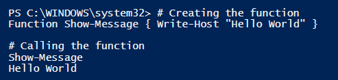
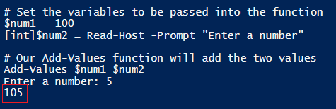
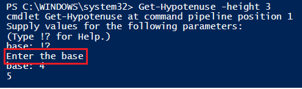

# PowerShell Functions

 

####Purpose

- Allows you to package you package blocks of closely related commands into a single unit that can be accessed by name.

- Allows one to write more efficient scripts because the same code does not need to be repeated multiple times.

 

####Rules
- Place a function near the beginning or top of the script - PowerShell must interpret the whole function before you use it in your code.
  
- Although not mandatory, it is recommended that a function follow the verb-noun cmdlet naming syntax.

 

####Function Items

- A PowerShell function contains the following items:
    - <code>Function</code> keyword
    - A scope (optional)
    - Name
    - Parameters (optional)
    - PowerShell commands enclosed in braces <code>{}</code>
    
 

####Syntax

Below is the syntax for a simple function.

    function <function-name> {statements}

The more complex syntax is listed below.
    
    function [<scope:>]<name> [([type]$parameter1[,[type]$parameter2])]
    {
      param([type]$parameter1 [,[type]$parameter2])
      dynamicparam {<statement list>}
      begin {<statement list>}
      process {<statement list>}
      end {<statement list>}
    }

 

####Simple Function Example

The function <code>Show-Message</code> below will simply write "Hello World" to the screen.
    
    # Creating the function
    function Show-Message { Write-Host "Hello World" }
    
    # Calling the function
    Show-Message 

Output:

 

####Return Keyword

- The **return** keyword exits a function

- It can be used to exit a scope at a specific point, return a value, or to indicate that the end of the scope has been reached.

- Allows you to pass back data to the section of the script that called the function in the first place.

 

####Passing Data to a Function

- A powerful aspect of functions is that it allows you to pass in data for processing.

- One way to pass data into a function is to declare variables after the function name.

- To call a function with passed data, you type the function name and then the passed data seperated by spaces.

    function <name> $dataitem1 $dataitem2

 

####Passing Data to a Function Example

Below is a function called <code>Add-Values</code> which was created to take the input of two values and sum them.

    # Function with two data items
    function Add-Values($num1,$num2)
    {
       return $num1 + $num2
    }
    
    # Set the variables to be passed into the function
    $num1 = 100
    [int]$num2 = Read-Host -Prompt "Enter a number"
    
    # Our Add-Values function will add the two values
    Add-Values $num1 $num2

Output:

The script correctly took the sum of 100 and the user supplied value of 5.

 

####Using Parameters

- Another way to pass data to a function is through using parameters.

- <code>Param</code> takes the data that is passed and stores it as declared variables.

 

####Parameters Examples

In the script below, a function is created which contains two parameters; message1 and message2.  The function then takes the result of these two messages and combines them.

    # Function to combine two messages
    Function Join-Message 
    { Param($message1,$message2)
      $newMessage = ($message1 + " " + $message2)
      return $newMessage
    }
    
    # Call the Join-Message function using the two provided parameters
    Join-Message -message1 "Hello" -message2 "World"
  
 

####Decorators

- The parameter block can accept decorators when declaring variables

- Decorators allow you to include additional arguments, perform input validation, and provide help info for your parameters.
  - The<code>\[Parameter()]</code> decorator is where you would state whether the argument is mandatory, its position, or help info.
  
 

####Decorators Example

The function below will return the hypotenuse of a right triangle.  The parameters have several decorators which state whether they are mandatory and give a help message.

    # Parameters with decorators
    Function Get-Hypotenuse 
    {
     Param(
          [Parameter(Mandatory=$False, HelpMessage="Is it a right triangle?")][bool]$isRight=$true,
          [Parameter(Mandatory=$True, HelpMessage="Enter the height")][float]$height,
          [Parameter(Mandatory=$True, HelpMessage="Enter the base")][float]$base
          )
    if($isRight) {
        $hypotenuse = [math]::Sqrt(($height * $height) + ($base * $base))
        return $hypotenuse
        } else { return "Triangle is not the right type" }
    
     }

Since we made the base a mandatory parameter, if we only enter the *height* parameter, the function will require the *base* parameter and provide us with a help message.
    
    Get-Hyportenuse -height 3

Output:

 

####Function Exercise

1. Write a function called Show-OddEven that will take an integer as input and return whether it is odd or even.

