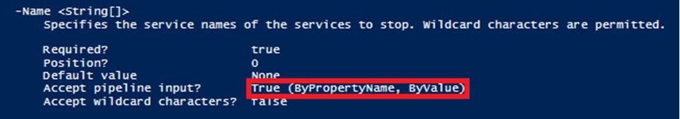

# Getting Help with PowerShell

####Get-Help cmdlet
- Offers built in help text for each command
- Contains several useful parameters
  - Full
  - Examples
  - ShowWindow
- Can be shortened from Get-Help to Help
  - Example: Help \*log\*

 
    
####Get-Command cmdlet
- Can assist in finding a particular command
- Contains several useful parameters
  - Noun
  - Verb
  - Name
  - Example: Get-Command -Verb Get -Noun *Process*

   

####Reading Help Files
- Very important for understanding PowerShell's pipeline
- It will allow you to understand if a command can accept pipeline input and what type of objects are permitted
 

Below is an example of the Stop-Service cmdlet’s help file. It first states that it can accept pipeline input and 
that it will look at the property name of the object being inputted.

 
**DO NOT** run the script below. This will first create an object of the services running on a system then it 
will stop all services on a system.  The Stop-Service cmdlet is accepting the property names from the Get-Service cmdlet.

- Get-Service | Stop-Service
 

