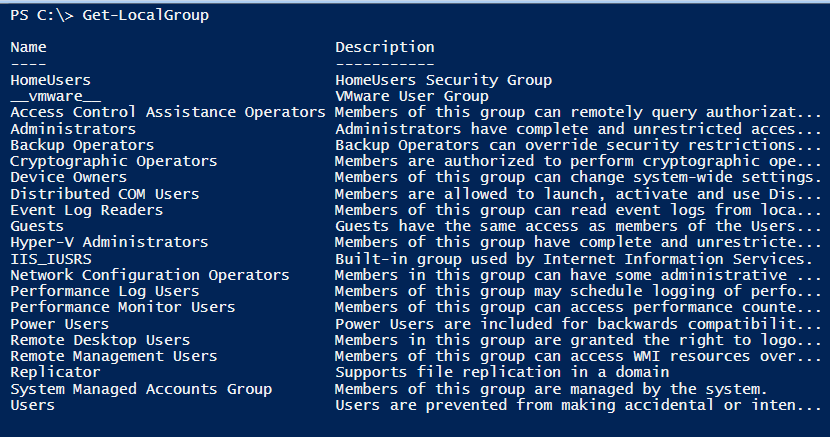
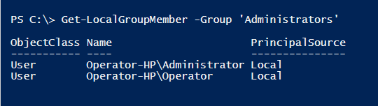
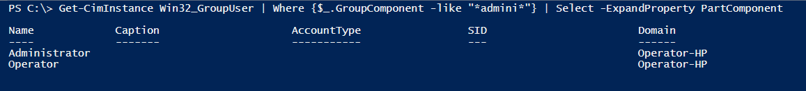

# Local Groups 

 

####Local Group Commands

- Get-LocalGroup
- Get-CimInstance -Class Win32_Group

 

####Local Group Examples
    # Uses the Get-LocalGroup cmdlet and the Name parameter to select the Administrators group
    Get-LocalGroup -Name “Administrators”
    
    # Uses the Get-CimInstance cmdlet and the Win32_Group class and filters for just the Administrators group
    Get-CimInstance -Class Win32_Group -Filter "Name='Administrators'"

 

####Local Group Members Commands

- Get-LocalGroupMember
- Get-CimInstance -Class Win32_GroupUser

 

####Examples
    # Uses the Get-LocalGroupMember cmdlet along with the Group parameter to display the members of the Administrators group
    Get-LocalGroupMember -Group “Administrators”
    
    # Uses the Get-CimInstance cmdlet along with the Win32_GroupUser class and filters for members of the Administrators group
    Get-CimInstance Win32_GroupUser | Where {$_.GroupComponent -like "*admini*"} | Select -ExpandProperty PartComponent

 

####Local Groups Exercise

 

Type <code>Get-LocalGroup</code> into the terminal and examine the output.

 

Enter <code>Get-LocalGroupMember -Group “Administrators”</code> in the terminal and examine the output.

 

Type <code>Get-CimInstance Win32_GroupUser | Where {$_.GroupComponent -like "\*admini\*"} | Select -ExpandProperty PartComponent</code> into the terminal and examine the output.

