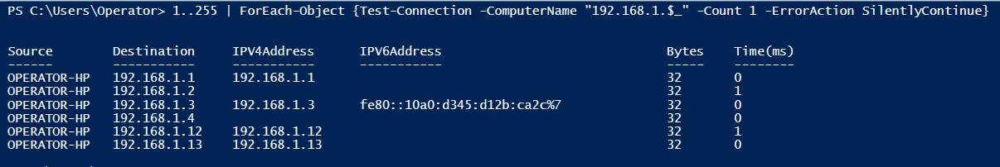
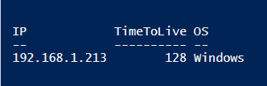

# Network Commands and Host Discovery

####PowerShell Network Commands

| *Powershell*                    | *Command Line* | *Description*                 |
| -------------------------------| ----------------| ------------------------------|
| Get-NetIPAddress               | ipconfig        | Verify the network config     |
| Test-NetConnection -TraceRoute | tracert         | Confirm the hops between hosts|
| Test-NetConnection             | ping            | See if the host is alive      |
| Test-Connection                | ping            | See if the host is alive      |
| Test-NetConnection -Port       | telnet          | Test service on a remote host |

 

####Performing a ping sweep

    1..255 | ForEach-Object {Test-Connection -ComputerName "192.168.1.$_" -Count 1 -ErrorAction SilentlyContinue}

The script above is first creating an array of numbers between 1 and 255. It then
pipes that object to be used as input for a for each loop for which it will loop through the last octet starting with 1
and testing every ip address up to 255.  So it will first test 192.168.1.1 then 192.168.1.2 then 
192.168.1.3, etc.

 

Since PowerShell is object oriented, it allows one to have a lot of flexibility on what they can 
do using it.  For example, using our ping sweep example from above, we can add functionality to 
determine the OS type by looking at the TTL.  Listed below is a script that will return if the 
OS is Windows or Linux.

    <# Function below takes a TTL as an input and based on that value
    will return either Windows or Linux #>
    function Get-OSType
    {
        [cmdletbinding()]
        Param
        (
            [Parameter(Mandatory=$true)]
            [int] $TTL
        )
    
       Process
       {
           switch ($TTL)
           {
                {$TTL -lt 65} {return "Linux"}
                {$TTL -in (65..128)} {return "Windows"}
                Default {return "OS Unknown"}
           }
        }
    }
    
    # Create an array object called ping sweep
    $pingSweep = (1..255) | foreach-Object {Test-Connection -ComputerName "192.168.1.$_" -Count 1 -ErrorAction SilentlyContinue}
    
    # Loops through each object in the pingSweep array and creates a custom object showing the OS
    foreach ($conn in $pingSweep)
    {
        [PSCustomObject]@{
        IP = $conn.Address
        TimeToLive = $conn.ResponseTimeToLive
        OS = (Get-OSType ($conn.ResponseTimeToLive)) }
    
    }

