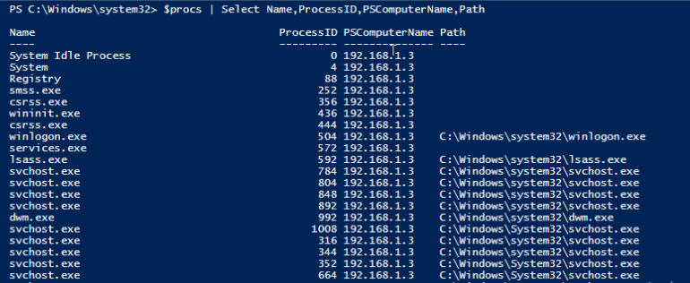
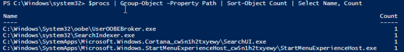
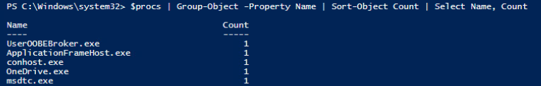

# Least Frequency Analysis

 

####Description

- Uses statistical analysis to highlight anomalies.  This analysis can be done on a single host, such as an infrequent event in the event logs, or over an entire network.

 

####Process

1. Determine the threshold
 - 10% is an example of a common threshold
2. Determine an accurate count of the items being analyzed
 - For example, the total number of events in the Security Event Log or the count of unique process paths per host on a network
3. Group by the properties you are analyzing
4. Filter for the items that are below the threshold

 

####Example

In this example, we are tasked to enumerate the hosts on a network and determine if there are any malicious processes running on any endpoints.  The network has 100 endpoints and we will be assigning a threshold of 10%, thus we will be looking for unique processes running with a count of 10 or less.

 

To start, we will gather all the processes running on the network.  We will do this by referencing a CSV file containing all of our targets.

    # Change creds as needed
    $Username = 'mylab\administrator'
    $Password = 'Password1!'
    
    # Create Credential Object
    [SecureString]$secureString = $Password | ConvertTo-SecureString -AsPlainText -Force
    [PSCredential]$creds = New-Object System.Management.Automation.PSCredential -ArgumentList $Username, $secureString
    
    # Import CSV file containing your targets
    $targs = (Import-Csv -Path 'C:\Temp\targs.csv').Hosts

    # Gather all of the processes running on our targets
    $procs = Invoke-Command -ComputerName $targs -Credential $creds -ScriptBlock {Get-CimInstance Win32_Process}

We will be performing a least frequency analysis on the Path and Process Name properties in the $procs object.

 

First, we will perform a least frequency analysis on the Path property using the code below.  Anything that is below our threshold of 10 we will be concerned with and perform further analysis.

    $procs | Group-Object -Property Path | Sort-Object Count | Select Name, Count

 

Next, we will perform a least frequency analysis on the Name property using the code below.

    $procs | Group-Object -Property Name | Sort-Object Count | Select Name,Count

