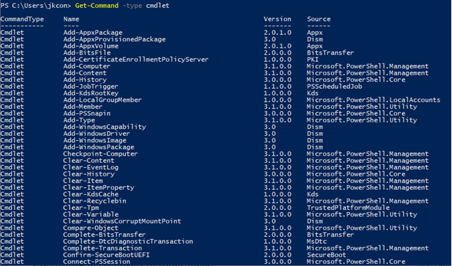
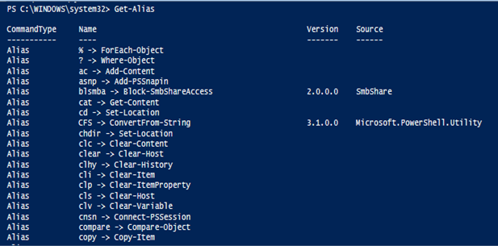

# PowerShell Review

 

####What is PowerShell?
- Object-oriented shell based on .NET framework
- Unlike most shells, it can accept and return .NET objects instead of just text 
  - PowerShell’s pipeline works completely differently from Bash 
    
- Consists of a command line shell and scripting language
- Used to perform task automation and configuration management
- Includes a pipeline which can send output objects from one command into another

 

####What are Cmdlets?

- Pre-compiled fully functional commands
- Named in a Verb-Noun format in which the noun is always singular
- Use <code>Get-Command -type cmdlet</code> to view available cmdlets in PowerShell
- Examples:
  
  - Get-Help 
  - Set-ExecutionPolicy
  - Get-Service
  - ConvertTo-HTML
  - Export-CSV
  - Write-Output

 

####Aliases

- Short names for cmdlets 
  
- Can make typing faster
    
- Allows you to use some old Windows commands that you know and love
  - Cd: Set-Location 
  - Cls: Clear-Host 
  - Del: Remove-Item
  - Diff: Compare-Object 
  - Dir: Get-ChildItem 
  - Kill: Stop-Process 
  - Echo: Write-Output
    
- Enter the <code>Get-Alias</code> cmdlet to view the available aliases

