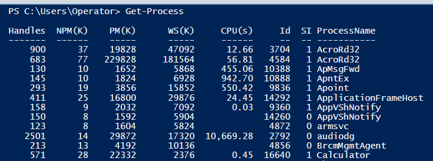
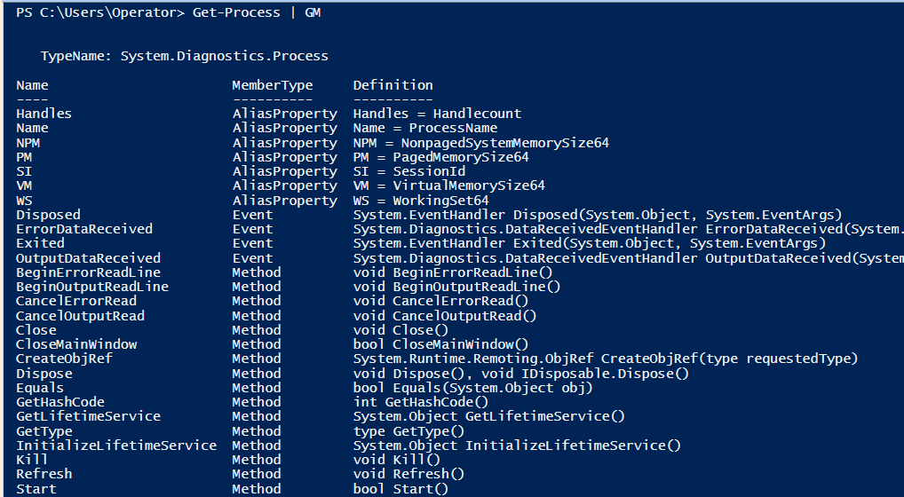
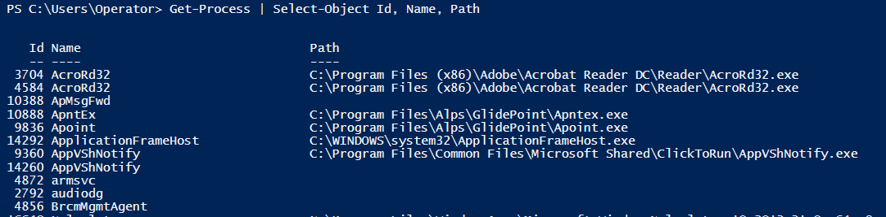
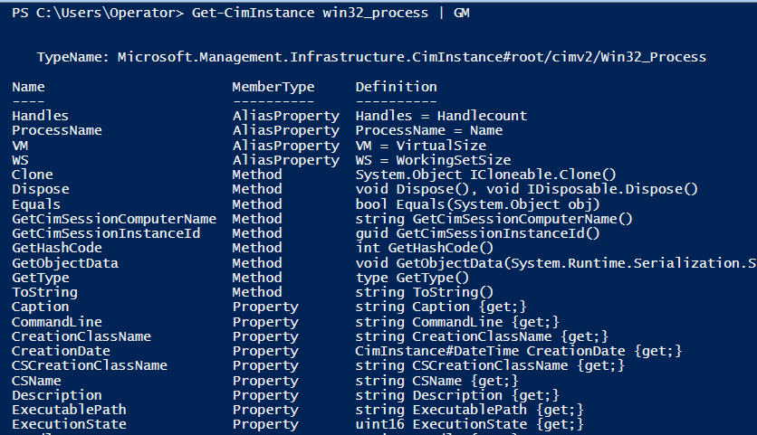
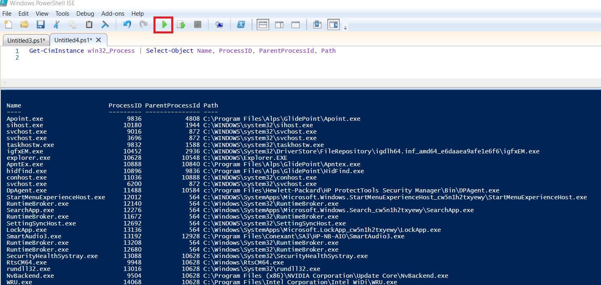
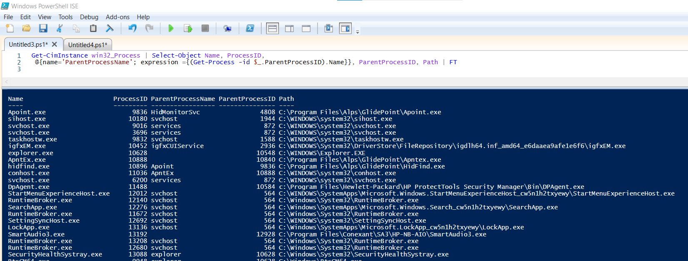

# Processes

####PowerShell commands to gather running processes from a host

- Get-Process
- Get-CimInstance Win32_Process
- Get-WmiObject Win32_Process

 

Important to note that Get-WmiObject cmdlet is deprecated, however, it can be used to get around firewall rules where Invoke-Command may fail or if WinRM is not running on the target. Get-WmiObject contains a *-Computer* parameter which by default uses the Distributed Component Object Model (DCOM) protocol instead of WinRM to access WMI on a target machine.

- You can view all the available classes for Get-CimInstance by using the Get-CimClass cmdlet

 

####Examples
    
    # Example 1 - Using the Get-Process cmdlet
    Get-Process | Select-Object Id, Name, Path
    
    # Example 2 - Using the Get-CimInstance cmdlet with the Win32_Process Class
    Get-CimInstance win32_Process | Select-Object Name, ProcessID, 
       @{name='ParentProcessName'; expression ={(Get-Process -id $_.ParentProcessID).Name}}, ParentProcessID

    # Example 3 - Using the Get-WmiObject cmdlet with the Win32_Process Class and executing the command against the remote computer 'Server1'
    Get-WmiObject win32_process -ComputerName ‘Server1’ | Select-Object name, processed, parentprocessid, commandline

 

####PowerShell Process Exercise
Type <code>Get-Process</code> into the PowerShell terminal and examine the output

 

Pipe <code>Get-Process</code> to the <code>Get-Member</code> cmdlet to view the available properties and methods for this object

 

Now, lets customize the output to suit our needs. Pipe <code>Get-Process</code> to <code>Select-Object</code> and pick a couple different properties to select that you think would be most useful.

 

You may have noticed that when you examined what properties were available to select from <code>Get-Process</code>, there was no parent process id to select.  Unfortunately, this is not available in <code>Get-Process</code>, however, it is available in
<code>Get-CimInstance win32_process</code> and <code>Get-WmiObject win32_process</code>.

 

Pipe <code>Get-CimInstance win32_process</code> to the <code>Get-Member</code> cmdlet.  Scroll down and notice that there is now a *ParentProcessId*
available to select.

 

Type <code>Get-CimInstance win32_Process | Select-Object Name, ProcessID, ParentProcessId, Path</code> into the PowerShell ISE
script pane and click the run button or hit the *f5* key on the keyboard.

 

This output is nice, but it would be even more useful if we knew the parent process name. Copy the code below into the PowerShell ISE script pane and click the run button or hit the *f5* key on the keyboard.

    Get-CimInstance win32_Process | Select-Object Name, ProcessID,
    @{name='ParentProcessName'; expression ={(Get-Process -id $_.ParentProcessID).Name}}, ParentProcessID, Path | FT

 

Notice that the parent process name is now displayed.  In order to get this to work we had to use what is called a hash table.  We will go into detail about how to use hash table later in this course.  Also, please note how the output was piped into the <code>Format-Table</code> cmdlet for a cleaner display.

 

 

