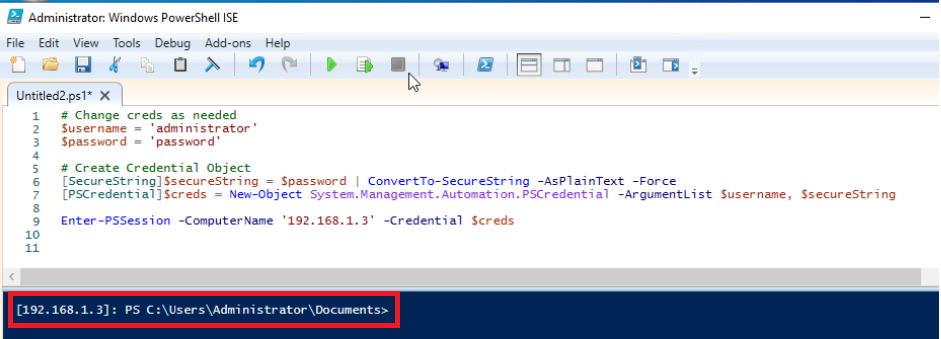
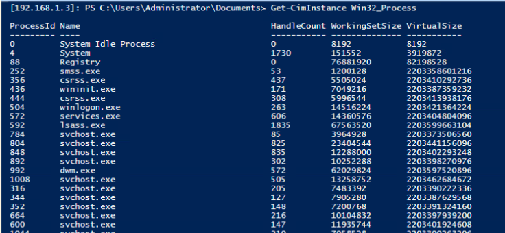
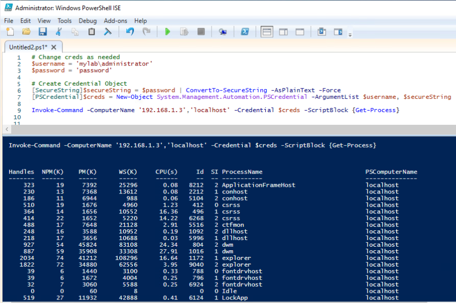

# PowerShell Remoting

It is important to understand that PowerShell has numerous ways to run commands remotely.  However, not every way will be secure and provide the functionality that you desire.

 

####Saving Credentials as a Variable
When using remote commands, you will save a lot of time by saving the credentials as a variable.  This will allow you to only have to enter the credentials once and be able to use it numerous times.

    # Change creds as needed
    $username = 'Admin'
    $password = 'Password'
    
    # Create Credential Object
    [SecureString]$secureString = $password | ConvertTo-SecureString -AsPlainText -Force
    [PSCredential]$creds = New-Object System.Management.Automation.PSCredential -ArgumentList $username, $secureString

If you want to type the credentials every time you execute a remote command, you can use the method below.

    $creds = Get-Credential

 

###One-To-One Remoting
If you desire a remote session with a single host and need it to be interactive then one-to-one remoting is a good choice.

 

####Commands
- Enter-PSSession
- Exit-PSSession

 

The example below creates a one-to-one remoting session with the workstation named "ws1",

    Enter-PSSession -ComputerName ws1 -Credential $creds

 

After executing the command, the PowerShell prompt will be preceded by [ip address/hostname].  This means that you have an interactive PowerShell session with that remote computer.

 

Now, you can type any commands and interact directly with that remote computer.

 

When you want to exit the PSSession, use the <code>Exit-PSSession</code> command.

    Exit-PSSession

 

###One-To-Many Remoting
Sometimes, you may need to run a command against many remote computers at the same time.  This is when one-to-many remoting can become a huge time saver.

 

####Commands
- Invoke-Command

 

Use the <code>Invoke-Command</code> cmdlet to run a command or script against many computers at the same time.  The code example below will pull the processes from the dc01 and ws1 remote computers.
    
    Invoke-Command -ComputerName 'dc01','ws1' -Credential $creds -ScriptBlock {Get-Process}

 

You can tell the output that belongs to which remote computer by looking at the *PSComputerName* property.

 

###Enabling PowerShell Remoting

 

Open a PowerShell console running as administrator and enter the command below.

    Enable-PSRemoting -force

 

Setup the WinRM service to start automatically

    Set-Service WinRM -StartMode Automatic

 

Verify that the WinRM service is running

    Get-WmiObject -Class win32_service | Where-Object {$_.name -like "WinRM"}

 

Set all remote hosts to trusted.  For security purposes, you will want to unset this later.

    Set-Item WSMan:localhost\client\trustedhosts -value *

 

Verify that all hosts are trusted

    Get-Item WSMan:\localhost\Client\TrustedHosts