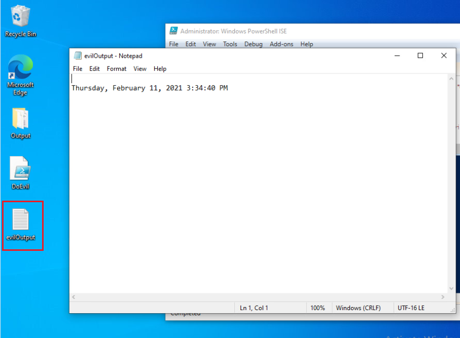
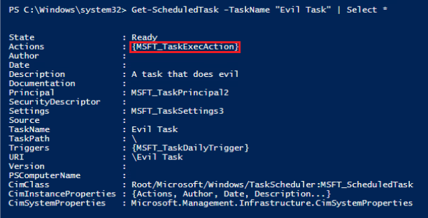
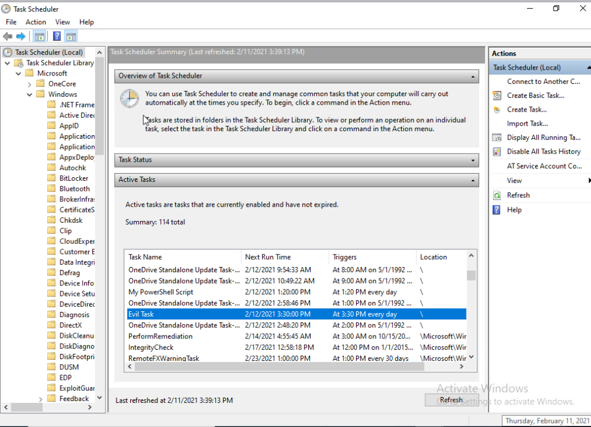
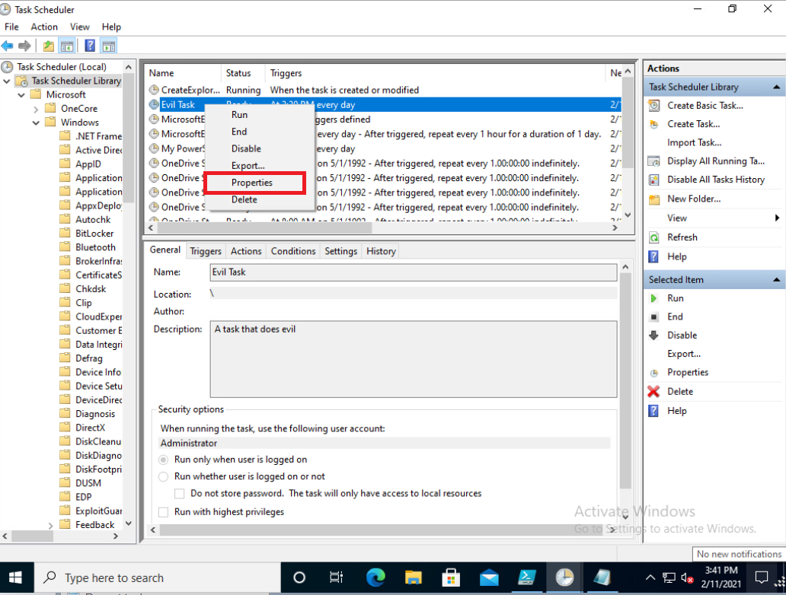

# Scheduled Tasks

Scheduled Tasks can be used to run an executable or script without being recognized by the user.  It is a frequently used method to gain persistence on a machine. 

 

####PowerShell Scheduled Task Commands

|*Command*                             |*Description*
|--------------------------------------|---------------------------------------------------------------------------------|
| Get-ScheduledTask                    | Returns the task definition object of a scheduled task registered on a computer |
| Register-ScheduledTask               | Registers a scheduled task definition on a local computer                       |
| Unregister-ScheduledTask             | Unregisters a scheduled task from the Windows Task Scheduler                    |
| New-ScheduledTask                    | Creates a scheduled task instance                                               |
| Start-ScheduledTask                  | Starts a registered background task                                             |
| Stop-ScheduledTask                   | Stops all running instances of a task                                           |
| Disable-ScheduledTask                | Disables a scheduled task                                                       |
| Enable-ScheduledTask                 | Enables a disabled scheduled task                                               |          

 

####Examples
    # Example 1 - Uses the Get-ScheduledTask cmdlet to pull all of the scheduled tasks
    Get-ScheduledTask | Select TaskName, TaskPath, Author, Date 
    
    # Example 2 - Uses the Unregister-ScheduledTask cmdlet to remove the "Windows Defender Scheduled Scan" task
    Unregister-ScheduledTask -TaskName "Windows Defender Scheduled Scan" 
    
    # Example 3 - Uses the Start-ScheduledTask cmdlet to run the "ScanSoftware" task
    Start-ScheduledTask -TaskName "ScanSoftware"
    
    # Example 4 - Uses the Stop-ScheduledTask cmdlet to stop the running "ScanSoftware" task
    Stop-ScheduledTask -TaskName "ScanSoftware"

    # Example 5 - Uses the Disable-ScheduledTask cmdlet to disable the "Windows Defender" task
    Disable-ScheduledTask -TaskName "Windows Defender"

 

####Creating a Scheduled Task

A scheduled task requires both an action and trigger in order to be functional.  You can add a security context and additional related settings, however, that is optional.

- Action: What is being executed by the scheduled task.  The most common actions are programs or scripts.  A scheduled task can have multiple actions.

- Trigger: This is what controls when the scheduled task will run.  The trigger can be time or activity based.

 

####Scheduled Task Exercise

We are going to start out by pretending to be an adversary attempting to do some malicious action via a scheduled task in PowerShell.
First create a simple script that will output some text to a file.  Feel free to use my example below but change the out-file path as needed.

    Get-Date | Out-File "C:\Users\Administrator\Desktop\evilOutput.txt" -Append

Save the script as "DoEvil.ps1" and remember the path to the script.

 

Open a new script in the PowerShell ISE.  We will now create the action for the scheduled task.  Make sure to change the argument path below to where you saved your "DoEvil" script. 

    $action = New-ScheduledTaskAction -Execute 'PowerShell.exe' -Argument "C:\Users\Administrator\Desktop\DoEvil.ps1"

 

Next, we will create the trigger that will prompt the scheduled task to perform the action.
    
    $trigger = New-ScheduledTaskTrigger -Daily -At 3:30PM

 

Last, we will need to register the scheduled task.

    Register-ScheduledTask -Action $action -Trigger $trigger -TaskName "Evil Task" -Description "A task that does evil"

Go ahead and hit the *f5* key to execute the script.

 

Check to see if the scheduled task was created.
Type <code>Get-ScheduledTaskInfo -TaskName "Evil Task"</code> into the terminal.

 

 

Instead of waiting for our time based trigger to activate, lets check right now.  Type <code>Start-ScheduledTask -TaskName 'Evil Task'</code> into the terminal.  If the scheduled task was created correctly, the "DoEvil.ps1" script should have run.

 

Now, we will be acting as the defender.  Enter <code>Get-ScheduledTask</code> into the terminal.  Immediately, we notice a strange task name "Evil Task".

 

We need to get more information as to what this task is doing.  Type <code>Get-ScheduledTask -TaskName "Evil Task" | Select \*</code> into the terminal.

 

It would be nice if we could get some detail on the actions of the scheduled task.
Type <code>(Get-ScheduledTask -TaskName "Evil Task").Actions</code> into the terminal.

Now you can see the name of the script that is being run.  If you wanted to see what that script entailed, you could always use the <code>Get-Content</code> cmdlet.

 

In addition to using PowerShell, you can also review the details of a scheduled task in a GUI via the "Task Scheduler" program.  Go ahead and open up Task Scheduler and scroll through the Active Tasks until you find "Evil Task".

 

When found, right click and look at the properties of the task.

 

Looking through the properties will give you an idea of the various settings and triggers that you can give a scheduled task.

Go ahead and exit out of the Task Scheduler program.

 

Enter <code>Unregister-ScheduledTask -TaskName "Evil Task"</code> into the terminal.

 

Click "Yes to All" in order to remove the task.

 

Type <code>Get-ScheduledTask -TaskName "Evil Task"</code> into the terminal.  You should receive an error if the task was removed.

 

