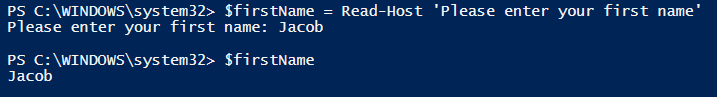
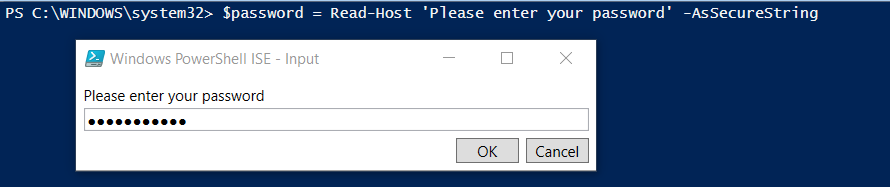

# Scripting Basics

 

In PowerShell, a script is nothing more than a text file that contains a series of PowerShell cmdlets.  We will start with the fundamentals of scripting and gradually move on to more advanced topics.

 

###Variables
 

####What is a variable?

- A unit of memory to which values are stored

- In PowerShell, variables are represented by text strings that begin with a dollar sign ($), such as $a, $computer, $var

 

####Variable Best Practices

- Keep variables meaningful, i.e. $computername

- Don’t use spaces in variable names - you are allowed, but its ugly.

- If a variable contains only one kind of object, declare it when you first use the variable.

 

####Variable Examples

- <code>$message = ‘Hello World’</code>

- <code>$servers = ‘server1’,’server2’,’server3’</code>

- <code>$process = (Get-Process)</code>

 

###Comments

 

####Purpose of Comments

- Allows the code to be easier to understand for others.
  
- They are ignored when running your script.

 

####Syntax

Single line comments use the "#" symbol. Below is an example of a single line comment being used.

    # This is a single line comment

Multi-line comments use the "<# #>" characters. Listed below is an example of a multi-line comment being used.

    <# This is a multi line comment
    I can keep typing and all of this will still be a comment
    PowerShell will not execute any of this #>
    
 

###Gathering User Input

There will be times that you want to prompt a user for input and save the value as a variable.  The way to do this in PowerShell is by utilizing the <code>Read-Host</code> cmdlet.

 

####Read-Host Description

- Reads a line of input from the console

- Frequently used to prompt a user for input

- You are able to save the input as a secure string, thus allowing you to securely prompt users for passwords.

 

####Examples

In the example below, the string "Please enter your first name" is displayed as a string in the console. When a value is entered and the Enter key is pressed, the value is stored in the <code>$firstName</code> variable.

    $firstName = Read-Host 'Please enter your first name'

 
    
This example displays the string "Please enter your password" as a prompt.  Since we are indicating it is a secure string, asterisks will appear in the console in place of input.  When the Enter key is pressed, the value will then be stored as a SecureString object in the <code>$password</code> variable.

    $password = Read-Host 'Please enter your password' -AsSecureString

