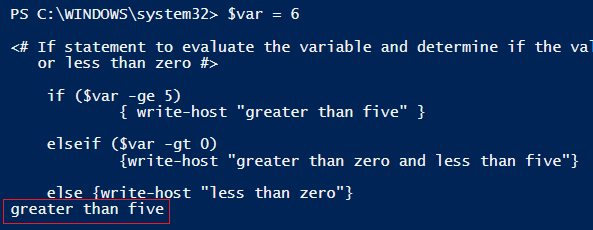
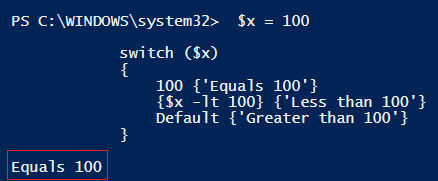

# Conditional Execution

 

There will be situations in which you will need your script to evaluate a condition or conditions and run code based on the result of the evaluation.
 

###If Statements

 

####Purpose

- Used to run a code block if a specified conditional test evaluates to true.

- By using *elseif*, you can specify additional conditional sets.

- The *else* statement is used to run a code block if all other conditional sets evaluate to false.

 

####Syntax
    if (<condition 1>)
          {<statement list 1>}
     elseif (<condition 2>) 
          {<statement list 2>}]
     else {<statement list 3>}]

 

####Example

    $var = 6
    
    <# If statement to evaluate the variable and determine if the value is greater than 5, less than 5 and greater than zero,
       or less than zero #>
       
    if ($var -ge 5) 
            { write-host "greater than five" }

    elseif ($var -gt 0)   
            {write-host "greater than zero and less than five"}

    else {write-host "less than zero"}

Output:

You can see that the program worked as expected and returned "greater than five".

 

###Switch Statements

 

####Purpose

- Can be used as an alternative to a series of If statements

- It is simpler and easier to read than a series of If statements

 

####Syntax
    Switch (<test-value>)
    {
    <condition> {<action>}
    <condition> {<action>}
    }

 

####Example

    $x = 100

    <# Switch statement that will look at the value in the variable and if it meets the
       condition, execute the appropriate action #>

    switch ($x)
    {
        100 {'Equals 100'}
        {$x -lt 100} {'Less than 100'}
        Default {'Greater than 100'}
    }

Output:

You can see that the program returned the expected value of "Equals 100".

 

###Conditional Exercise
In this exercise you will create a secret word checker.  

 

####Directions
1. Save a word to a variable that will act as the secret word.
2. Prompt the user to guess the secret word and save the result as a variable. 
3. If the user guesses the secret word correctly, display a Congrats message, otherwise display a Sorry message.  Please note, you can accomplish this by either using an If or Switch statement.
