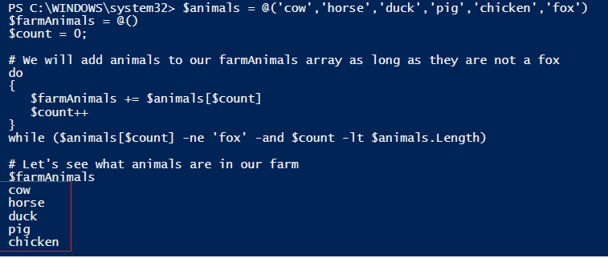
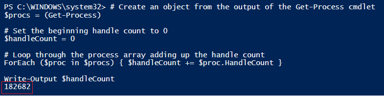
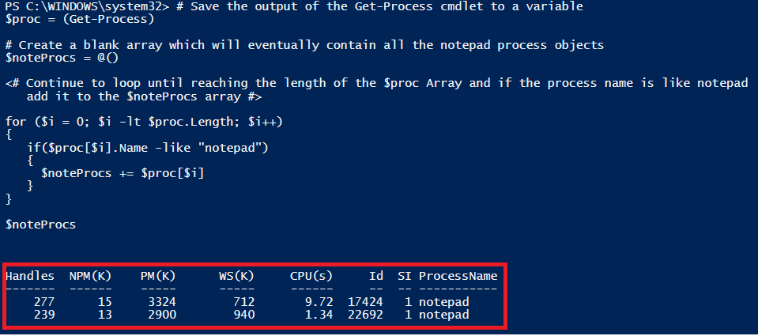
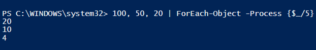
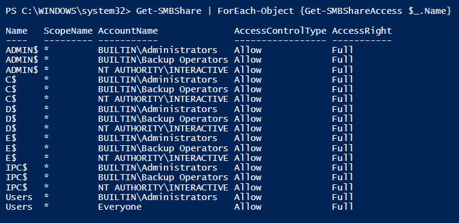

#PowerShell Looping Structures

 

####Description

- A **loop** allows an instruction to repeat until a specified condition is met.

- PowerShell's four main looping structures are:
    1. Do/While
    2. Do/Until
    3. ForEach
    4. For
  
    
- In PowerShell, loops can be very helpful in situations where you need to take in an array of objects and process the individual values in the array.

 

### Do While Loop
 

####Purpose
- Used to execute a task when a value does not equal a specified value.

 

####Syntax

    do {<statement list>} while (<condition>)

 

####Example
In the example below, the program will add animals to the *farmAnimals* array as long as they are not a fox and as long as the animal count is not greater than that of the *animals* array.

It is always a good idea to add a condition to make sure that you will not result in an endless loop.

    $animals = @('cow','horse','duck','pig','chicken','fox')
    $farmAnimals = @()
    $count = 0;
    
    # We will add animals to our farmAnimals array as long as they are not a fox
    do
    {
       $farmAnimals += $animals[$count]
       $count++  
    }
    while ($animals[$count] -ne 'fox' -and $count -lt $animals.Length)
    
    # Let's see what animals are in our farm
    $farmAnimals
    
Output:

You can see from the output that all the animals except for "fox" were added to the array.

 

####Do/While Loop Exercise
1. Write a script that uses a Do/While loop that will print only even numbers from 1 to 100 and then stop

 

### Do Until Loop
 

####Purpose
- Used when you need to repeat a set of statements as long as the condition is false.

 

####Syntax

    do {<statement list>} until (<condition>)

 

####Example

In the example below, the security event logs generated in the last five minutes are exported to a csv file until the end date set is reached.

    # Set the end time
    $endDate = (Get-Date).AddHours(1)
    
    # Export security events collected in the last five minutes
    Get-WinEvent -FilterHashtable @{ LogName = ‘Security’; StartTime = (Get-Date).AddMinutes(-5)} | Export-Csv -Path "C:\Temp\SecurityEvents.csv" -NoTypeInformation
    Start-Sleep -Seconds 300
    
    # Do Until Loop
    do
    {
        # Export security logs from last five minutes
        Get-WinEvent -FilterHashtable @{ LogName = ‘Security’; StartTime = (Get-Date).AddMinutes(-5)} | Export-Csv -Path "C:\Temp\SecurityEvents.csv" -Append -NoTypeInformation
        
        # Sleep for 5 minutes
        Start-Sleep -Seconds 300
    
    }
    until ((Get-Date) -gt $endDate)

###ForEach Loop

 

####Purpose

- Used to execute a task on or based on each item in a specified array.
- Consists of an object variable and an array variable.

 

####Syntax
    ForEach (item In collection) {ScriptBlock}

 

####Example

In the example below, an array is created of process objects. The ForEach loop then iterates through this array and sums the handle count of each process.

    # Create an object from the output of the Get-Process cmdlet
    $procs = (Get-Process)
    
    # Set the beginning handle count to 0
    $handleCount = 0
    
    # Loop through the process array adding up the handle count
    ForEach ($proc in $procs) {$handleCount += $proc.HandleCount }
    
    Write-Output $handleCount

Output:

 

####ForEach Loop Exercise

1. Create an array containing various names of zoo animals.
2. Using a ForEach loop, print each animal name in the array in upper case.

###For Loop

 

####Description

- It has a more complex looping structure than the previous examples.

- The For command has three required sections separated by semicolons. 
  - **First Section**: declares a variable that will interact with the loop.
    
  - **Second Section**: is the conditional statement that tells the loop to continue while the statement is true.
  
  - **Third section**: tells the loop to either increment or decrease the first variable by a certain number.
  
 

####Syntax

    for (<Init>; <Condition>; <Repeat>)
    {
      <Statement list>
     }

 

####Example

In the example below, the $proc variable contains the output from the <code>Get-Process</code> cmdlet.  The for loop is iterating until it reaches the length of the $proc variable. As it is iterating, it tests if the process object is notepad and if so, will add it to the $noteProcs array. 

    # Save the output of the Get-Process cmdlet to a variable
    $proc = (Get-Process)
    
    # Create a blank array which will eventually contain all the notepad process objects
    $noteProcs = @()
    
    <# Continue to loop until reaching the length of the $proc Array and if the process name is like notepad
       add it to the $noteProcs array #>
    
    for ($i = 0; $i -lt $proc.Length; $i++)
    { 
       if($proc[$i].Name -like "notepad")
       {
         $noteProcs += $proc[$i]
       }
    }
    
    $noteProcs

Output:

The program produces an array containing only the notepad process objects.

 

####For Loop Exercise
1. Using a for loop, print the odd numbers from 1 to 100.

 

### ForEach-Object Cmdlet

 

####Description

- Performs an operation on each item in a collection of input objects.

- Used for processing objects coming in via the pipeline.

- Alis is %

 

####Syntax

    ForEach-Object <scriptblock>

 

####Examples

 

In this example, an array is created, piped to the <code>ForEach-Object</code> cmdlet, and the script will divide each item by the integer 5.
    100, 50, 20 | ForEach-Object -Process {$_/5} 

Output:

 

For the example below, the output from the <code>Get-SMBShare</code> cmdlet is piped to the <code>ForEach-Object</code> cmdlet.  The scriptblock is then executing the <code>Get-SMBShareAccess</code> cmdlet on each share name.  The result is a list of all the local accounts who have access to each share.

    Get-SMBShare | ForEach-Object {Get-SMBShareAccess $_.Name}

Output:

 

####ForEach-Object Exercise
1. Using the code below and the <code>ForEach-Object</code> cmdlet, create a new array of Animal objects using the animal names from the $animals array provided.
2. After creating the array of animal objects, use the <code>ForEach-Object</code> cmdlet to execute the Speak method for each object contained in the array.

      # Animal Class
      class Animal {
        # Properties
        [string]$species
    
        # Constructor
        Animal(
          [string]$species
          
       ){
          $this.species = $species
        }
    
        # Speak Method
        Speak() 
        {
         Write-Host ('Hello I am a ' + $this.species)
        }
    }
    
    # Array of animal names
    $animals = @('elephant','hippo','zebra','alligator','lion','tiger','bear’)