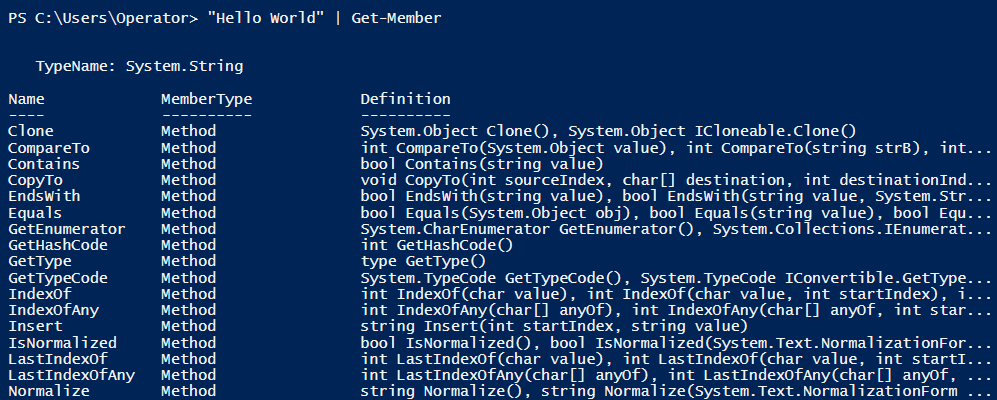

# Scripting Review

####Windows PowerShell ISE

- There are many options, but PowerShell ISE is the best choice for writing PowerShell scripts
- You could use Notepad, but why would you torture yourself

 

####Adjusting Layout

- You can adjust the layout of the script pane by clicking on the show
script pane options
  

 

####Useful Shortcuts

- ctrl + j: will instantly give examples of for loops, if statements, functions, and many other useful things.
- F8: The F8 key will run only what you have selected in the script pane 
- F5: The F5 key will run your entire script
- Tab: The tab key is crucial to avoid typos

 

####Get-Member cmdlet

- The most important cmdlet for learning how to work with objects in PowerShell
- Allows you to view a complete listing of a properties’ members, that is its properties and methods.

 

###Objects Explained

 

####What is an Object?

- An object is an abstract data type which can include properties, methods, or even other objects.

 

####What are Properties?

- Describe the attributes of what the object is representing

 

####What are Methods?

- Describe the types of actions that the object can undertake
- Allows an object to act on itself

 

####Objects in PowerShell

- **Everything** in PowerShell is an object
- Every response you receive from running a cmdlet is a .NET object
- Objects in PowerShell can be easily manipulated

 

###PowerShell Objects Exercise

 

Type “Hello World” into the PowerShell ISE console.  It may just look like boring text, however, it is a functional object

 

This time, type “Hello World”.Length into the console.  This referenced the “Hello World” object’s length property

   
 

Now, type “Hello World”.ToUpper() . This “Hello World” object has a method that will display its text in upper case

   
 

To see a list of this object’s properties and methods, type “Hello World” | Get-Member into the console

 

Notice how the type of object is listed as System.String

 

 

