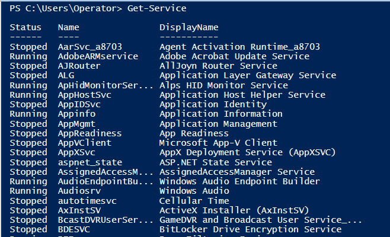
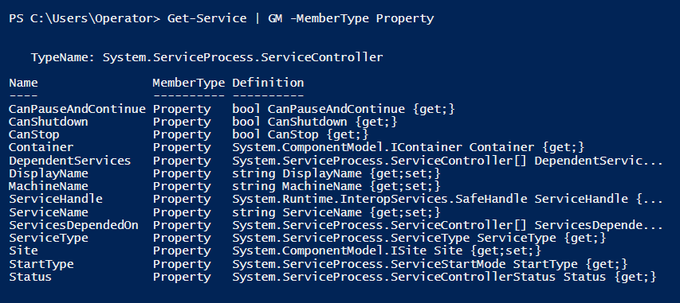
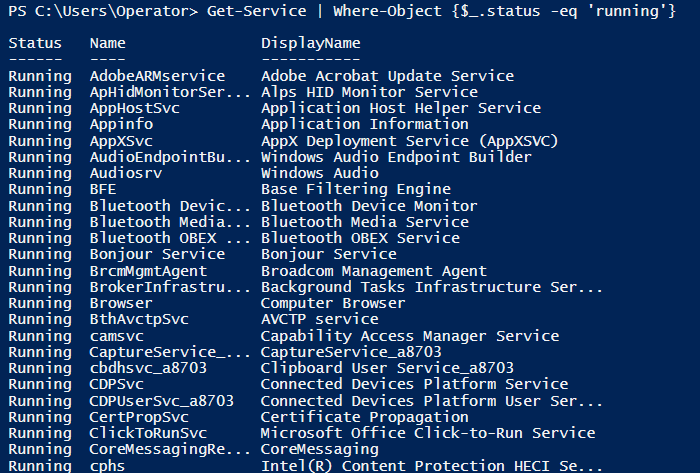
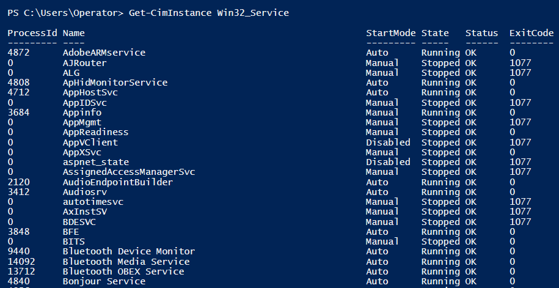
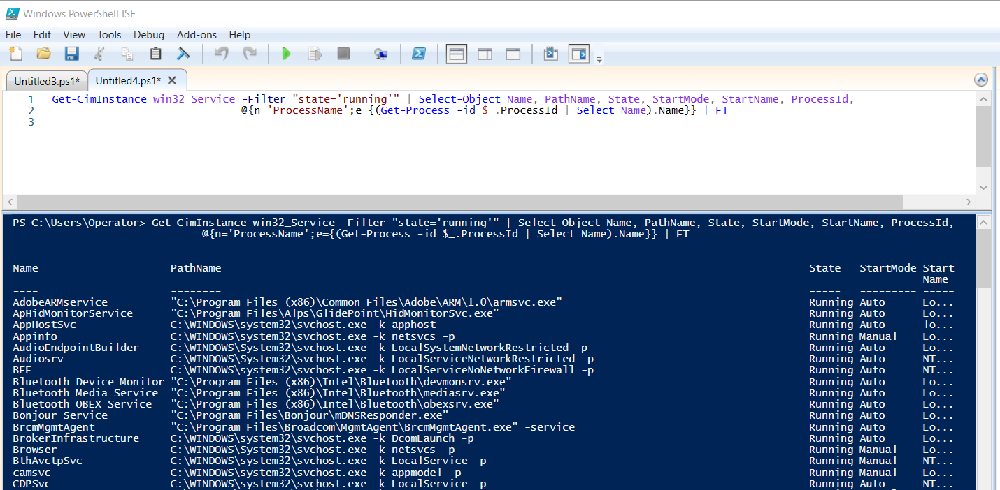
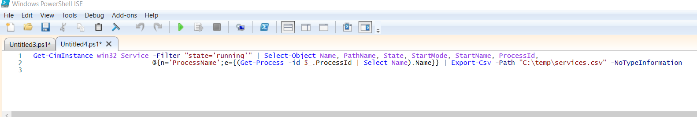
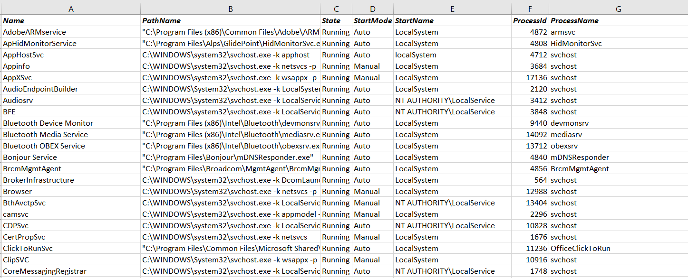

# Services

####PowerShell commands to gather services from a host

- Get-Service
- Get-CimInstance Win32_Service
- Get-WmiObject Win32_Service

 

####Examples
    
    # Example 1 - Using the Get-Service cmdlet
    Get-Service | Where-Object {$_.Status -eq “Running”}

    # Example 2 - Using the Get-CimInstance cmdlet with the Win32_Service Class and filtering for running services
    Get-CimInstance Win32_Service -Filter “State=‘Running’"
    
    # Example 3 - Using the Get-CimInstance cmdlet with the Win32_Service Class and filtering for running services and selecting certain properties
    Get-CimInstance Win32__Service -Filter “State=‘Running’" | Select-Object Name, PathName, State, StartMode, StartName,
       ProcessId, @{n='ProcessName';e={(Get-Process -id $_.ProcessID | Select Name).Name}} | FT

    # Example 4 - Using the Get-WmiObject cmdlet with the Win32_Service Class and filtering for running services
    Get-WmiObject Win32_Service  -Filter “State=‘Running’” -ComputerName ‘Server1’ | Format-Table

 

####PowerShell Service Exercise

 

Type <code>Get-Service</code> into the PowerShell terminal and examine the output

 

In the terminal, pipe <code>Get-Service</code> to the <code>Get-Member</code> cmdlet and analyze the properties that are available to select.
Notice that there is no option to select the process ID or the name of the process that started the service.  Normally,
services are run as an instance of the svchost.exe process, so it would be nice to identify anything that breaks this norm.

    Get-Service | GM -MemberType Property

 

Pipe <code>Get-Service</code> to a <code>Where-Object</code> cmdlet selecting only the services that are currently running.

    Get-Service | Where-Object {$_.status -eq 'running'}

 

Type <code>Get-CimInstance Win32_Service</code> into the terminal and examine the output.  Notice that all the running services list the 
process ID that started the service.

 

Now that we know how to grab the process ID, lets use a hashtable to display the process name as well. Type the command below into
the PowerShell ISE script pane and click run or type the *f5* key to execute.  

    Get-CimInstance win32__Service -Filter "state='running'" | Select-Object Name, PathName, State, StartMode, StartName, ProcessId,
                                  @{n='ProcessName';e={(Get-Process -id $_.ProcessId | Select Name).Name}} | FT

 
Well this is a problem, notice that because we piped this object to the Format-Table cmdlet many of the fields got cut off.  We could
pipe this object to the Format-List cmdlet, but that would be a tedious way to analyze the data.

 

Instead of piping it to Format-Table, lets pipe this to the Export-CSV cmdlet and view the output.

    Get-CimInstance win32__Service -Filter "state='running'" | Select-Object Name, PathName, State, StartMode, StartName, ProcessId,
                                  @{n='ProcessName';e={(Get-Process -id $_.ProcessId | Select Name).Name}} | Export-CSV -Path C:\temp\services.csv -NoTypeInformation

 

Open up the services.csv file that you created and examine the contents.  Notice that the output is very clean and allows us to easily filter
for the services that were not started with the svchost.exe process.

