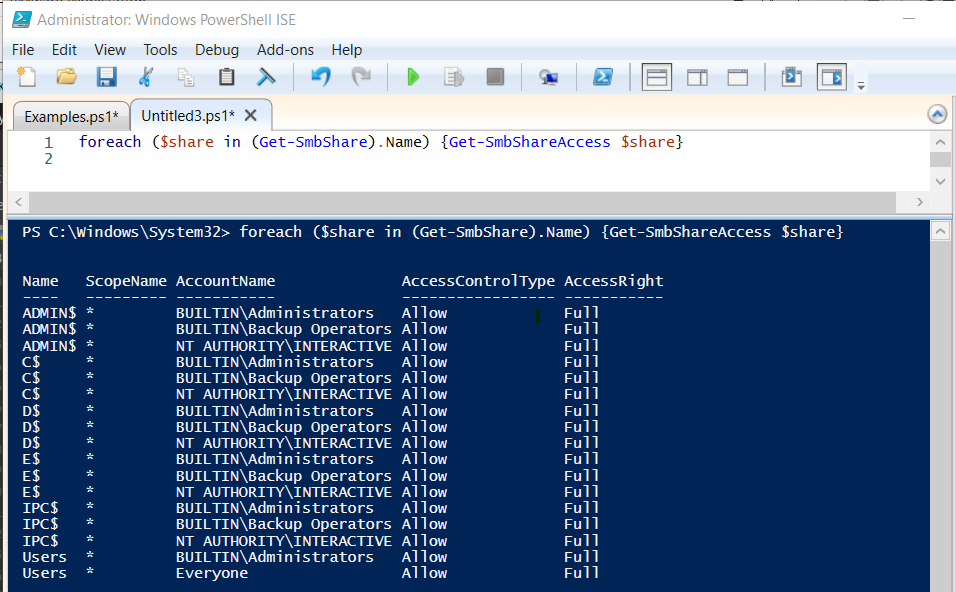

# Shares

####Admin$

- This is a hidden network share created by Windows NT family of operating systems that allow system administrators to have remote access to every disk volume on a network-connected system. It cannot be permanently deleted but may be disabled and it can only be accessed by users without administrative privileges.

 

####IPC$

- This share is also known as a null session connection.  This share was designed by Microsoft to allow users to perform enumeration of names of domain accounts and network shares.

 

####PowerShell Commands to get info on Shares

- Get-SmbShare
- Get-SmbShareAccess
- Get-CIMInstance Win32_Share

 

####PowerShell Command to view NTFS permissions

- Get-ACL

 

####Examples
    # Example 1 - Uses the Get-SmbShare cmdlet and select certain properties
    Get-SmbShare | Select Name, Path, Description

    # Example 2 - Uses the Get-SmbShare cmdlet and the -Name parameter to select a certain share and examine all of its properties
    Get-SmbShare -Name OfficeShare | Select-Object -Property *

    # Example 3 - Uses the Get-CimInstance cmdlet with the Win32_Share class to pull the available shares from a remote computer
    Get-CIMInstance -Classname Win32_Share -computername DC1 -filter "Type=0"
    
    # Example 4 - Uses the Get-ACL cmdlet to view the NTFS permission for the C:\Windows directory
    Get-ACL “C:\Windows” | Format-Table -Wrap

    # Example 5 - Uses a for each loop to loop through all the available shares and pull the share permissions for each
    foreach ($share in (Get-SmbShare).Name) {Get-SmbShareAccess $share}

 

####Share Exercise

Type <code>foreach ($share in (Get-SmbShare).Name) {Get-SmbShareAccess $share}</code> in the PowerShell ISE Script pane and hit the *f5* key to execute.  Examine the output.

