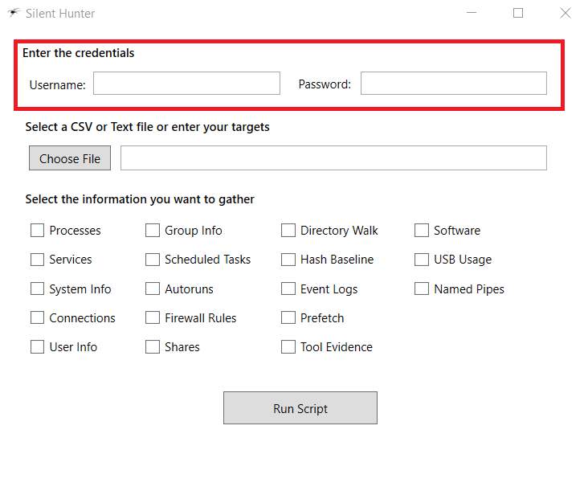
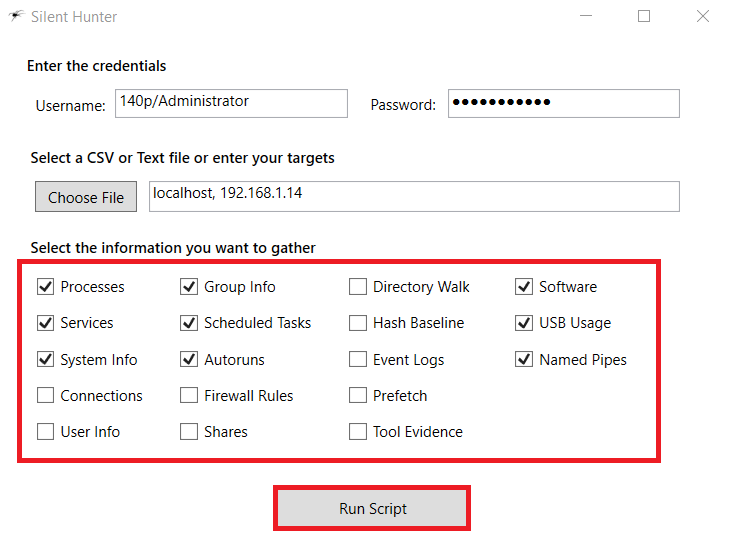

# Silent Hunter

 

####Purpose

- Silent Hunter is a script that I created which has a GUI and makes performing host enumeration incredibly simple.
- The script is located on my github at <https://github.com/jconeby/PowerShell/blob/master/SilentHunter.ps1>

 

###Silent Hunter Directions

1.	Double click to open the “Silent Hunter.exe” file or run the “SilentHunter.ps1” script
2.	Enter the domain or local credentials for the machine(s) that you want to enumerate
  - For domain usernames, you need to enter using the format “domain\username”

3.  Click the “Choose File” button to upload a CSV or text file containing your targets.  Alternatively, you can type your targets separated by commas directly into the text box.
  - If you use a text file, make sure that the targets are separated by commas

4.  Click the check boxes of the information that you want to gather and click the “Run Script” button

5.  If you choose the “Event Logs” option, a window will be displayed asking you to select a file and choose a date range.  
  - Click the “Choose File” button and select the “Windows_Event_Log.csv” file.  The “Windows_Event_Log.csv” file is a list of events that the program will loop through to query.  Events can be added to this file but must follow the correct format.

  - Select the date range that you want to query events for and click the “Save” button.
  
6.  If you choose the “Tool Evidence” option, a window will be displayed asking you to choose a file.  
  - Click the “Choose File” button and select the “registry_IOC.csv” file.  This is a file that contains a series of registry key entries along with the associated attacker tool that creates them.  Additional keys can be added so long as it follows the proper format.
  
  - Click the “Save” button  
  
7.  After the program has finished execution, there should be a folder named “Output” on your desktop containing a series of CSV files and an XML file which stores all the info enumerated.  If you run this program again, and select any options, the XML file will be updated only with the options selected.  For example, if you chose processes, services, and user info the first time, and only processes the second time, only the processes CSV file and the processes property in the XML file will be updated. 

