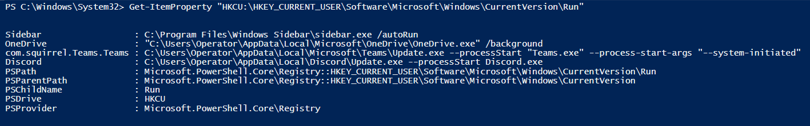

# Startups 

When the Windows operating system is booted up, some programs will run automatically without any user interaction.  These programs are launched from the startup folder.  When performing live forensics, it is very important to review a list of these programs.

 

A common technique for gaining persistence on a target is by adding an entry to the “run keys” in the Registry or Startup folder. After the key is added, the program will be executed under the context of the user and will have the account’s permissions level.

 

|*Registry Keys Used During Startup*                                                             |
| -----------------------------------------------------------------------------------------------|   
| HKCU:\HKEY_CURRENT_USER\Software\Microsoft\Windows\CurrentVersion\Run                          |               
| HKCU:\HKEY_CURRENT_USER\Software\Microsoft\Windows\CurrentVersion\RunOnce                      |
| HKLM:\HKEY_LOCAL_MACHINE\Software\Microsoft\Windows\CurrentVersion\Run |
| HKLM:\HKEY_LOCAL_MACHINE\Software\Microsoft\Windows\CurrentVersion\RunOnce |
| HKCU:\HKEY_CURRENT_USER\Software\Microsoft\Windows\CurrentVersion\Explorer\User Shell Folders |
| HKCU:\HKEY_CURRENT_USER\Software\Microsoft\Windows\CurrentVersion\Explorer\Shell Folders |
| HKLM:\HKEY_LOCAL_MACHINE\SOFTWARE\Microsoft\Windows\CurrentVersion\Explorer\Shell Folders |
| HKLM:\HKEY_LOCAL_MACHINE\SOFTWARE\Microsoft\Windows\CurrentVersion\Explorer\User Shell Folders |
| HKLM:\HKEY_LOCAL_MACHINE\Software\Microsoft\Windows\CurrentVersion\RunServicesOnce |
| HKCU:\HKEY_CURRENT_USER\Software\Microsoft\Windows\CurrentVersion\RunServicesOnce |
| HKLM:\HKEY_LOCAL_MACHINE\Software\Microsoft\Windows\CurrentVersion\RunServices |
| HKCU:\HKEY_CURRENT_USER\Software\Microsoft\Windows\CurrentVersion\RunServices |

 

|*Startup Folder Location*                                                       |
|--------------------------------------------------------------------------------|
|C:\Users\USERNAME\AppData\Roaming\Microsoft\Windows\Start Menu\Programs\Startup |
|C:\ProgramData\Microsoft\Windows\Start Menu\Programs\Startup                    |

 

####PowerShell Commands for Startup Info

- Get-Item -Path <*registry key path*>
- Get-ItemProperty -Path <*registry key path*>
- Get-CimInstance Win32_StartupCommand
- Get-ChildItem -Recurse "C:\Users\*\AppData\Roaming\Microsoft\Windows\Start Menu\Programs\Startup"

 

####Examples
    
    # Example 1 - Get the registry value from the path listed
    Get-Item -Path "HKCU:\HKEY_CURRENT_USER\Software\Microsoft\Windows\CurrentVersion\Run" |
      Select Name, @{name="Property"; e={[string]($_.Property -join ',')}}
    
    # Example 2 - Returns the list of startups
    Get-CimInstance Win32_StartupCommand | Select-Object Name, command, Location, User | Format-List 

 

####Startups Exercise

 

Type <code>Get-CimInstance Win32_StartupCommand</code> into the terminal and examine the output.  The programs that are set to run on startup will be displayed.

 

Now, lets view more of the properties that are available in this object. Type <code>Get-CimInstance Win32_StartupCommand | Select-Object Name, command, Location, User | Format-List</code> into the terminal and view the output. You can see that the Location and User properties are a great addition for analysis.

 

Type <code>Get-ItemProperty "HKCU:\HKEY_CURRENT_USER\Software\Microsoft\Windows\CurrentVersion\Run"</code> into the terminal and examine the output.

 

It would be nice if we could query all the auto run keys at once instead of having to type out the command and path for each registry key.  This is where scripting comes in handy.  Open a text file and copy and paste the autorun registry keys from the table.
Save the file as registry.txt

 

Type <code>$regkeys = Get-Content <path of registry.txt></code> into the PowerShell ISE script pane.  In this command we are grabbing the content from the registry.txt file and saving it as an array object in PowerShell.

 

Add another line and type <code>Get-Member -InputObject $regkeys</code> and hit the *f5* key to execute the script.  You will see a list of methods and methods and properties for the object.

 

Remove the <code>Get-Member -InputObject $regkeys</code> line from your script.  Type the following into the PowerShell ISE script pane <code>$regkeys | ForEach-Object {Write-Output $\_; Get-ItemProperty $\_}</code>. Hit the *f5* key to execute the script.

 

The script loops through the regkey array object and writes the content of the key name as well as executing the Get-ItemProperty cmdlet on each key.

