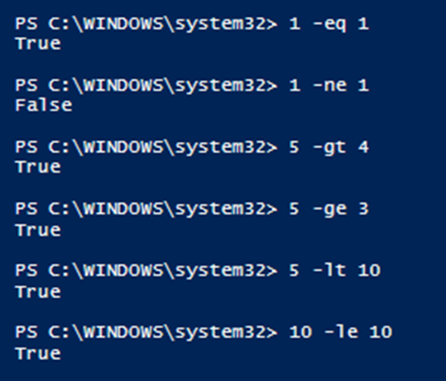

# PowerShell Syntax

####About Syntax

   -  PowerShell **is not** case sensitive 
   - Get-Process, get-process, and GeT-PRoCess will run the same
   - PowerShell calls its arguments “Parameters” 
   - Provide parameter names and their associated value
   - Parameter names start with a dash such as -ComputerName, -ID, -Module
   - Some parameters have no value, i.e. –force
   - With some parameters the order matters – look at the Help to determine

 

####Conditional Operators

   - -eq: equals
   - -ne: not equal to 
   - -gt: greater than 
   - -ge: greater than or equal
   - -lt: less than
   - -le: less than or equal

 

####Escape Character
   - PowerShell uses the backtick as its escape character

   - Can be used with a variable to display the variable name instead of its content</li>
   - Example
        - Entering <code>$var=3; echo `$var</code> in PowerShell will output "$var"

 

####Formatting Strings
 - \`n: New line
 - \`r: Carriage return
 - \`r\`n: Carriage return + New Line
 - \`t: Horizontal tab
 - \`v: Vertical tab

 

####Command Separator
 - The semicolon ; is used to split up multiple commands on the same line
 - First-Command; Second-Command; Third-Command

 

####Quotation Marks

 - Either single or double quotes may be used to specify a literal string

 

####Concatenating Strings

- Use a "+" sign to concatenate strings

 

####Pipe
- A series of commands can be connected by using the pipeline operator (|)
- The output of the first command can be sent for processing as input to the second command
- In the example below, the Get-Process cmdlet is going to search for the Notepad process object and then send that object to the Stop-Process cmdlet to terminate that process object.
    - Example: Get-Process notepad | Stop-Process
- To support pipelining, the receiving cmdlet must have a parameter that accepts pipeline input

The pipe is one of the most important aspects of PowerShell. It is truly
amazing that objects can be passed through the pipe

**CAUTION!** Sometimes you can accidentally do some crazy things when piping objects.
For example, <code>Get-Process | Stop-Process</code> would crash your computer as it would stop every process running.

