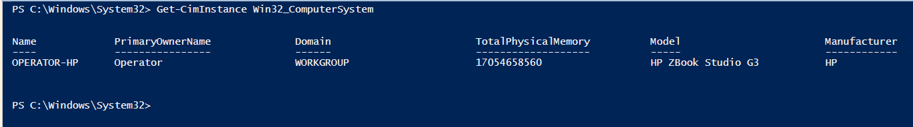
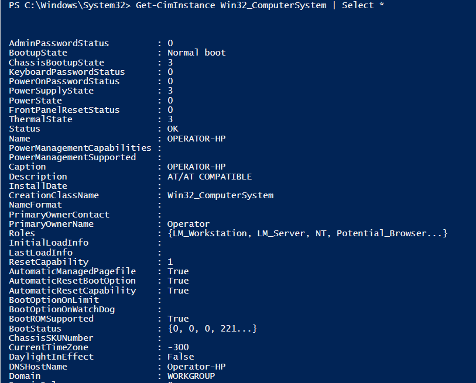

# Gathering System Information 

|*PowerShell Commands for System Info*                                      | Description                                            |
|---------------------------------------------------------------------------|--------------------------------------------------------|
| Get-ComputerInfo                                                          | Gets a consolidated object of system and OS properties |
| Get-HotFix                                                                | Used to see what hotfixes have been installed          |
| Get-CimInstance -ClassName Win32_ComputerSystem                           | Lists the system properties                            |
| Get-CimInstance -ClassName Win32_OperatingSystem                          | Lists the OS properties                                |
| Get-CimInstance -ClassName Win32_Processor                                | Lists the processor properties                         |
| Get-CimInstance -ClassName Win32_QuickFixEngineering -Property HotFixID   | Used to see what hotfixes have been installed          |

 

####System Info Exercise

Type <code>Get-CimInstance Win32_ComputerSystem</code> into the terminal and examine the output.

 

This returns some basic computer system info in a table, however, it would be nice to see all the properties available in this object.

 

Type <code>Get-CimInstance Win32_ComputerSystem | Select \*</code> into the terminal and review the output.  There is clearly a lot of very detailed information contained in this object.

