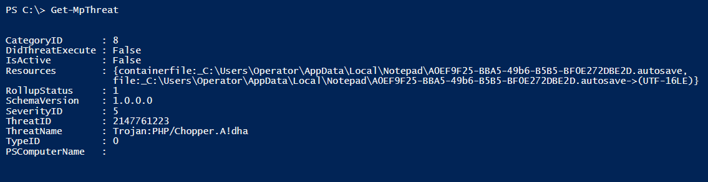

# Windows Defender History 

 

####Commands

- Get-MpThreat
 - Gets the history of threats that Windows Defender has detected on a computer

 

####Examples

- Get-MpThreat -ThreatID 34 #Get the history of a detected threat - this one is generated by downloading PowerView
- Get-MpThreat -CimSession 'DC1’

