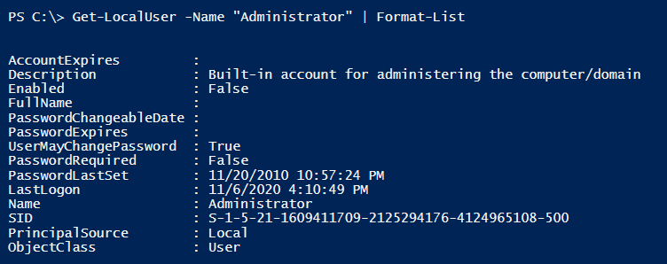

# Local Users 

 

####Commands

- Get-LocalUser
- Get-CimInstance -Class Win32_UserAccount

 

####Examples
    # Uses the Get-LocalUser cmdlet to pull the "Administrator" user
    Get-LocalUser -Name “Administrator” 
    
    # Uses the Get-LocalUser cmdlet to pull the user based off a SID
    Get-LocalUser -SID S-1-5-21-9526073513-1762370368-3942940353-500
    
    # Uses the Get-CimInstance cmdlet with the Win32_UserAccount class to display all of the local users on a computer
    Get-CimInstance -Class Win32_UserAccount -Filter  "LocalAccount='True'" | Format-Table -Wrap
    
    # Same as command above except selecting only certain properties
    Get-CimInstance -Class Win32_UserAccount -Filter  "LocalAccount='True’” | Select PSComputername, Name, Status, Disabled, AccountType, Lockout, PasswordRequired, PasswordChangeable, SID
    
    # Uses the Get-CimInstance cmdlet with the Query parameter to leverage CQL query language to pull the Administrator user account
    Get-CimInstance -Query "select \* from win32_useraccount where name='Administrator'"

 

##Logged On Users

 

####Commands to get Logged-On Users

- query user
- Get-CimInstance -Class Win32_LoggedOnUser
- Get-CimInstance -Class Win32_LogonSession

The <code>query user</code> command provides the best info and is definitely the easiest to read and interpret.  Unfortunately, from my experience, this command is not available on a lot of machines.
That being the case, sometimes you will have to use a combination of the <code>Get-CimInstance Win32_LoggedOnUser</code> and <code>Get-CimInstance Win32_LogonSession</code> commands to determine the currently logged in users.

 

####Local Users Exercise

Type <code>Get-LocalUser -Name "Administrator" | Format-List</code> into the terminal and examine the output

 

Type <code>Get-CimInstance -Class Win32_UserAccount -Filter "Name='Administrator'" | Select \* | Format-List</code> into the terminal and examine the output.

 

Type <code>query user</code> into the terminal and examine the output.

Now, lets practice as if the <code>query user</code> command is not available on the machine.  Copy and paste the code below into the PowerShell ISE script pane and click the *f5* key to execute.  Although this gives us more information that we need, we are able to determine the logged in users.

    $loggedOnUsers = Get-WmiObject win32_loggedonuser
    $sessions      = Get-WmiObject win32_logonsession
    $logons        = @()
    
    foreach ($user in $loggedOnUsers)
    {
        $user.Antecedent -match '.+Domain="(.+)",Name="(.+)"$' > $nul
        $domain = $matches\[1]
        $username = $matches\[2]
        $user.Dependent -match '.+LogonId="(\d+)"$' > $nul
        $LogonId = $matches\[1]
        $logons += \[PSCustomObject]@{
            Domain  = $domain
            User    = $username
            LogonId = $LogonId
            }    
    }
    
    foreach ($session in $sessions)
    {
        $logonType = switch ($session.LogonType)
             {
                 1 {"Interactive"}
                 2 {"Network" }
                 3 {"Batch"}
                 4 {"Service"}
                 5 {"Unlock"}
                 6 {"Network Cleartext"}
                 7 {"New Credentials"}
                 8 {"Remote Interactive"}
                 9 {"Cached Interactive"}
                 Default {"Unknown"}
             }
        \[PSCustomObject]@{
            LogonId     = $session.LogonId
            LogonTypeId = $session.LogonType
            LogonType   = $logonType
            Domain      = ($logons | Where {$_.LogonId -eq $session.LogonId}).Domain
            User        = ($logons | Where {$_.LogonId -eq $session.LogonId}).User
            StartTime   = \[management.managementdatetimeconverter]::todatetime($session.starttime)
            }
    
    }

