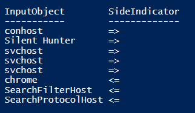

# Using XML in PowerShell 

 

####Description

- PowerShell allows you to import, export, and modify XML files

- The main advantage to XML is that it allows you to export complex objects

- Exporting to a CSV flat file will not import or export complex objects correctly

 

####XML Commands

- Import-Clixml

- Export-Clixml

 

####Example

In the example below, we are first creating a PS Custom Object which contains the output of the Get-Process and Get-Service cmdlets.  We are going to save this result to an XML file on disk in order to reference it later on.  It could be useful to compare to a process or service list at a later date and possible catch a malicious executable.
    
    # XML Object Example
     
     # Create a PS Custom Object
     $myObject = 
         [PSCustomObject]@{      
                             Process = Get-Process
                             Service = Get-Service
                          }
    
    # Export the object to an XML file on disk that can be re-imported later
    $myObject | Export-Clixml -Path "C:\Temp\myObject.xml"
                          

Now, we will import the previously saved XML file and compare the *Process* property with the results of a current process list.

    <# Import the previously exported object and compare the processes to a current
    process list to find anomalies #>

    # Import the XML file as an object
    $refObject = Import-Clixml -Path "C:\Temp\myObject.xml"
    
    # Current Process Name List
    $currProcess = (Get-Process).Name
    
    # Compare the process property from the reference object with a current process list
    Compare-Object $refObject.Process.Name $currProcess

Output:

